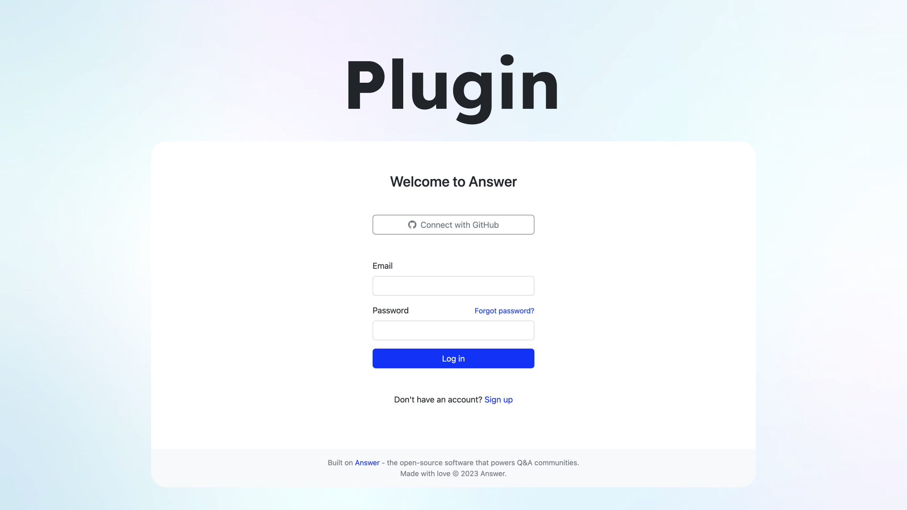
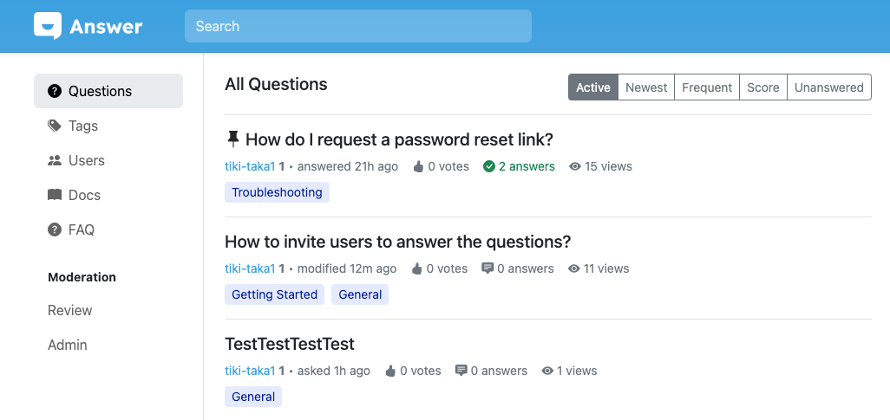
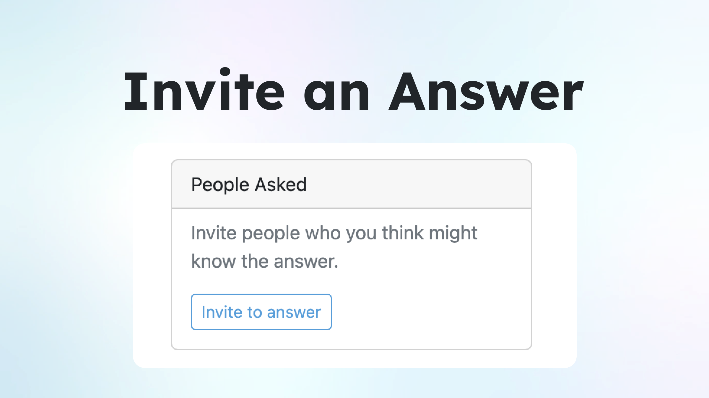
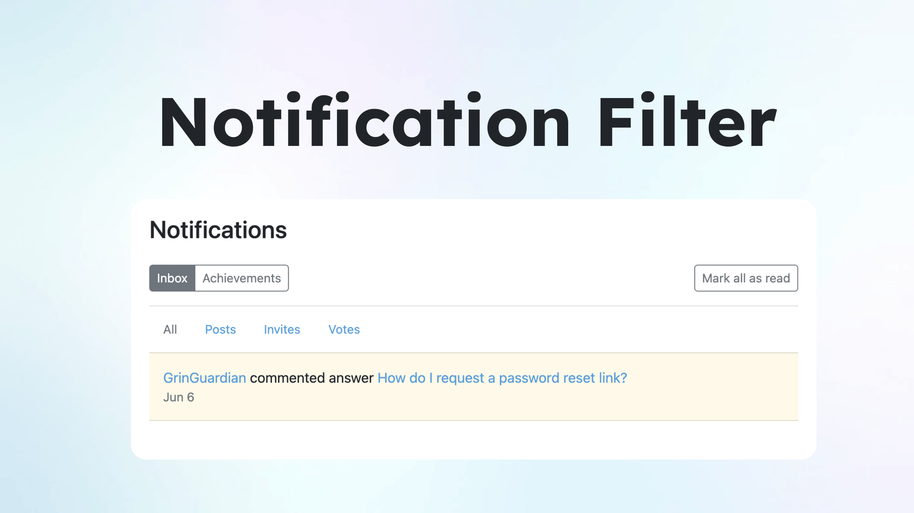

We made it, and it’s official here: Answer v1.1.0 is now available on GitHub.   
  
From 1.0 to 1.1.0, it's not just a stack-up of numbers, but a step forward for your Answer in: **security, functionality, and stability**. Find out what are the updates, and how you can use them to boost productivity. Don’t forget to update ;)

## Plugin: The New Wings to Your Answer

The most notable in this update is **the support of Plugin**. From small tweaks to big changes, you can make it happen in Answer. Read the documentation of Plugin [here](https://answer.dev/docs/development/extending/) before bust a move.

A quick example is to embrace a simplified and efficient user authentication experience with the plugin's OAuth capabilities for your Answer. Now, your community members can sign up or log in with existing accounts from social media platforms. For adding other log-in options, admin can go **Admin\>Plugins\>OAuth2Basic**, then fill in the necessary information in **OAuth2Basic**.

Add features, customize appearance, or enhance functionalities with Plugin and make Answer in the way you want. Don’t forget to share with us your work.

## Navigation Bar: New Home. Better View.

All the tabs you need are now on the left side of the window, providing an intuitive and easy-to-read experience.

For admins, switching between visitor and admin mode is faster, which helps admin to view instant changes or updates.

Customize the sidebar based on your needs. Add new tabs linked to related sources or pages for users. Here’s where Admin do the magic: **Customize\>CSS/HTML**.

## Invite an Answer: Expertise Meets the Right Answer

Unlock collective wisdom and collaboration for your Answer. Invite someone you know who possess the expertise or insights of the question to share with the community. 

Before officially sending an invitation to an expert, you’ll have to earn reputation scores first. In Answer, we’ve automated the [reputation system](https://answer.dev/docs/recipes/contents/reputation/) to maintain community ecology. Reputation reflects your contribution to the community. By earning more reputation score, you’ll [unlock more features](https://answer.dev/docs/recipes/contents/permission) in Answer.

For admins, you can always choose the right reputation level for your community at **Admin\>Settings\>Privileges**. 

This not only enhances problem-solving effectiveness, but also a way of getting your community members connected. 

## Notification Filter: Read Messages You Need

No more clumsy scrolling for the latest notification. We divide notifications into **Posts, Invites, and Votes**, and highlight unread messages in light yellow. You can also click and head to the post right away. 

Our team also adds Gravatar mirror URL configuration, ensuring a smooth and efficient user experience, while we keep an eye on the default order of your question list so that Answer will keep it in mind for your next visit. For bug fixes and improvements, you can visit our [GitHub releases](https://github.com/answerdev/answer/releases?page=1), and remember to update.
