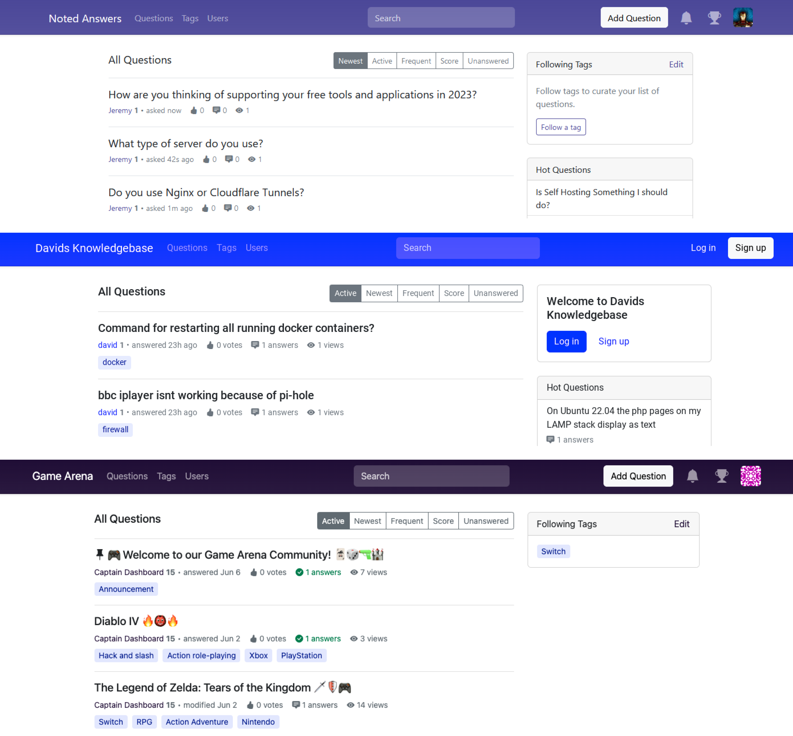

Whether you’re a user of Answer, curious about the stories behind Answer, or simply an open-source lover, you’ve come to the right place.

Today, we'll share more stories behind Answer: how we started it, the tech stack we picked, and the next step on our roadmap. Find out more about Answer, and have a deeper understanding of Answer, our motivation, and the people behind it.

## What is Answer

Answer is a Q&A software which allows users to ask and answer questions about a particular topic or subject. It’s open-source, and everyone can access it freely.
You can use it to build a platform in the form of Q&A. No matter a knowledge base, product forum, a support, Answer got it covered.

## Why Answer?

Recently, we noticed that B2B enterprises have been looking for solutions to build their own Q&A community or a corporate community. A dedicated section or subsection obviously cannot meet their needs because they request to customize content, have control over their data, rather than just “being a guest” in a public community.

That’s the moment we decided to build Answer — to help individuals, teams, and company at different scales to run their Q&A platform easily while have full control over their data.

## Why Answer is Open-source?

We’ve been longing to share our research and experience over the years in Q&A communities. The best way is to create an [open-source project](https://github.com/answerdev/answer) that is accessible to everyone. We have also made Answer website and plugins open-source on [GitHub](https://github.com/answerdev).

## What is Answer built with?

Answer is mainly built Golang, and React.js.

## What license is the code under?

Apache-2.0 license.  
It’s a highly flexible, business-friendly, community-supportive, and easy-to-manage license.

## What’s the browser requirements?

You can always run Answer on the latest and stable release of the browsers. These are the minimum browser requirements.

* Microsoft Edge: Version 100 and later.
* Mozilla Firefox: Version 100 and later.
* Google Chrome: Version 90 and later.
* Apple Safari: Version 15 and later.

## Can I browse Answer on mobile devices?

Sure ;)  
You can browse Answer in Safari, or Chrome on your mobile devices.

## What’s the Difference between Wiki and Answer?

|            | Answer                                                                | Wiki                                                                         |
| ---------- | --------------------------------------------------------------------- | ---------------------------------------------------------------------------- |
| Format     | Question and answer. Focus on problem-solving, and mutual assistance. | Document. Emphasize content enhancement. Suitable for writing long articles. |
| Management | Based on tags. Categorize and search information quickly.             | Based on structure. Coherent and organized knowledge system.                 |
| Governance | Reputation system and mutual trust.                                   | Individuals and editors.                                                     |

## Who build Answer?

We are a small and agile team, working closely with each other in different cities. As a part of the open-source community, we have also received love and help from contributors around the world.

## Can I use Answer?
<<<<<<< HEAD
Why not?   
With a simple and intuitive design, you can build a [knowledge base](../2023-05-30-everything-you-need-to-know-about-knowledge-base), game forum, or support center with Answer smoothly. [Answer 1.1.0](../2023-05-11-answer-1.0.9-release/) also supports plugins so that you can enhance Answer’s performance in the way you want. 
=======

Why not?
With a simple and intuitive design, you can build a [knowledge base](../2023-05-30-everything-you-need-to-know-about-knowledge-base/index.md), game forum, or support center with Answer smoothly. [Answer 1.1.0](../2023-06-15-answer-1.1.0-release/index.md) also supports plugins so that you can enhance Answer’s performance in the way you want.
>>>>>>> 07f6f47474ba263f53f8b3ab00e1072be991eda2

## How do I Get Answer?

Oh, it’s easy. Everything you need is [here](https://answer.dev/docs/installation/), and just follow the guide.

## I saw Answer cloud, what is it?

Answer Cloud is the SaaS version of Answer, designed to assist businesses in setting up their Answer quickly without technical assistance.
