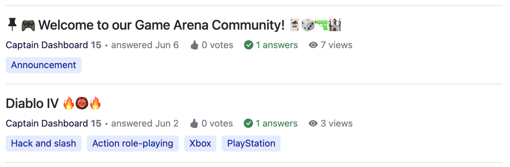
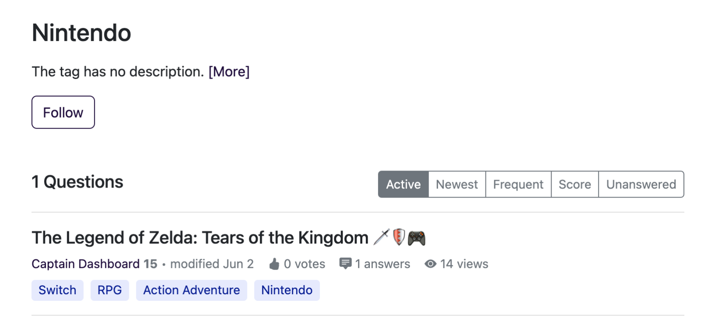

Online communities thrive with knowledge exchange, sharing, and collaboration. Gradually, content accumulated and moderator needs to ensure easy access and navigation for everyone. 

Organizing content is the key for the community, and using tags to categorize and structure content is the key to keep community organized. 

Discover more about tags, benefits, and how vital they are for organizing content in Answer.

## What are Tags
Tags are descriptive labels or keywords assigned to posts. Moderators can use tags to classify and group related posts together, making it easier for members to find and browse relevant content. 

## Benefits of Using Tags
Tags are popular, you can find it in different forms of content, such as articles, posts, images, etc. They are not only just tools for effective content organization, but also play a vital role to engage and retain your audience. Here’s why.

1. Efficient Organization and Management             
Tagging simplifies content management, making it easier for users to find specific topics based on themes or keywords. For admins, this small action maintains the current content structure easily, while adding new branch is not a burden anymore. 

2. Improved Searchability            
Tags provide additional ways that enhance search functionality. Users can quickly find relevant content by searching for specific tags in [knowledge base](../2023-05-30-everything-you-need-to-know-about-knowledge-base/index.md).

3. User-friendly Navigation                     
Tags offer a user-friendly navigation experience. Select a tag to filter the content, providing a personalized content stream at their interests or preferences.

4. Recommend Relevant Content                 
Content system can suggest related content for users based on the tags, improving both engagement and user experience. 

## How are Tags Used in Answer               
In Answer, tag is a thread that connects users, content, and moderator. With more tags, the community becomes a big net. Community members can add one or more tags to the post as an initial step for content organization, while moderators can check and fix it later. Here are common examples of how tags are used in Answer.

1. Organize Content            
Moderator can group related posts together and help organize content based on specific topics, themes, or categories. 

2. Quick Search           
Tags make content more discoverable. In Answer, users can search for specific tags to find relevant content they are looking for.

3. Filter Content                  
Tags help users filter and browse content. Select a tag, and users can narrow down their view to specific topics or categories in Answer. Ever better, users can click and start following a tag to browse content they are interested. 

4. Group Related Content              
Tags enable recommendations of related content. In Answer, users can find suggested content with similar tags on the right side when viewing a post. This encourages users to explore more relevant knowledge, and it's great for [knowledge sharing](../2023-06-20-how-to-improve-knowledge-sharing-with-answer/index.md).

5. Analyze Trend                 
Analyzing popular tags helps identify trends in Answer. In Answer, you will see numbers of questions in each tag, which provide insights into user preferences and interests.

## Conclusion
Use tags to weave a web of content as well as better content management, searchability, and user experience. You can start tagging, and gradually build a tagging system to manage your content efficiently. In Answer, everything about tagging is ready and easy to start. Both users and admins will love it for sure. Start a wonderful content management journey [with Answer](https://answer.dev/docs/installation) from today. 