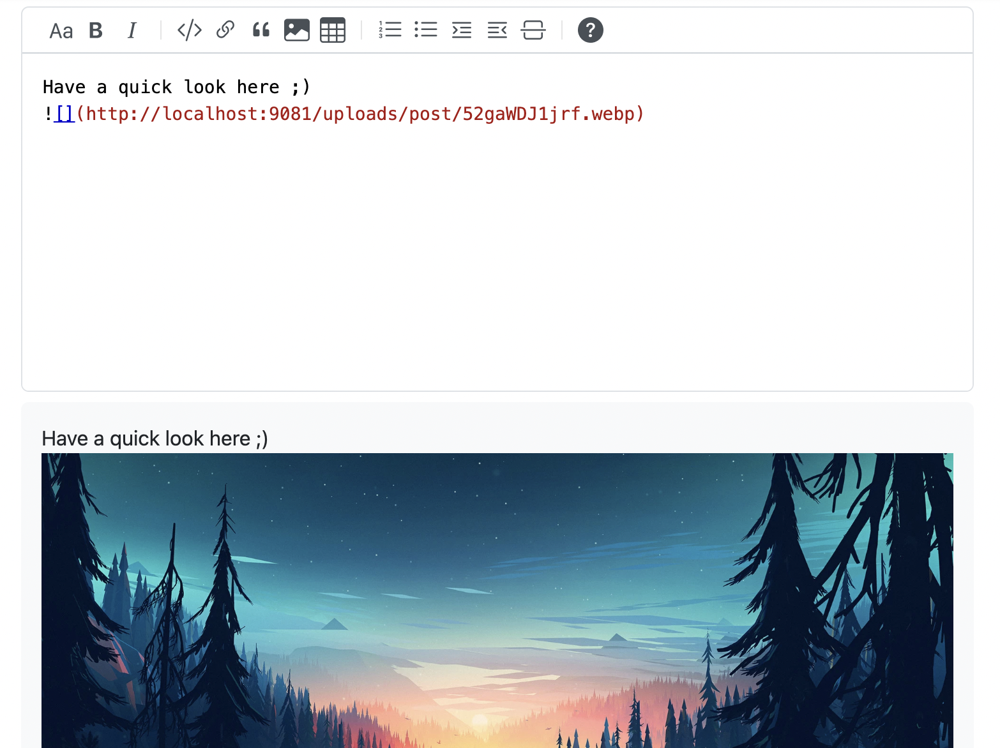
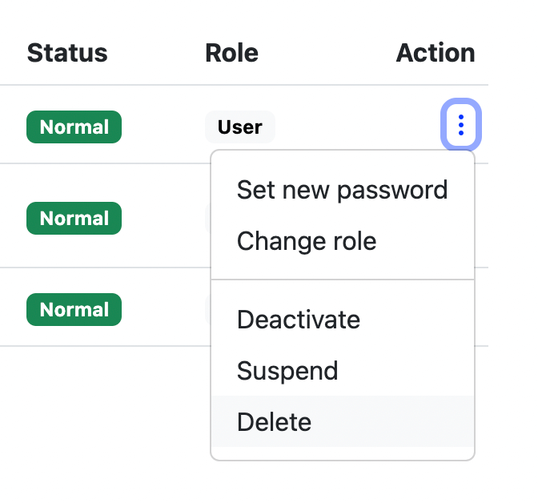

After a pretty smooth transition of our project (thanks to our mentor), we’ve been learning the process, refining details, ensuring that everything complies with Apache. It’s challenging since we’re working in a new way, but still, we are pleased to announce the first release of Answer from Apache incubator! Before the [update](https://answer.apache.org/docs/upgrade) to Answer v1.2.0, have a quick look at some of the new arrivals. 

## Bring Back Deleted Q&A
Accidentally delete a question or an answer? Go ask the admin to bring them back easily.

For admins, simply go Admin page, then Contents. Recover the content by clicking Undelete in action. It works for both questions and answers.

You can also click the post and jump to the deleted content for a double check before the recovery. 

## Delete Users and Content in One Click
The feature was brought by the user in the [community](https://github.com/apache/incubator-answer/issues/429), and he discussed accessibility to the content from that user after leaving the community. 

The choice is yours now. We provide an option to delete the user and content belonged at once, or simply delete the user. 

The content remains with no access to the user’s profile, if you choose to delete the account only.

## New Support Format: GIF and WebP
Make your post juicy by adding GIF and WebP. Simply click Add Image, choose GIF or WebP, and have an instant preview of that. 

## Remove Inactive User
Say goodbye to ghost accounts and hello to a more engaged and thriving space. Now you can remove them with just a click! Maintaining a vibrant and active community just gets easier.

## Even Better ...
Enjoy a smoother ride with fresh fixes and improvements. Say goodbye to private browsing issues, search errors, and display glitches. Plus, enjoy an enhanced admin action menu, streamlined editor, and improved anonymous user display rules. Don’t forget to share with shortern URLs, and we've even banished duplicate form submissions.

## How to Get the Latest Answer 
If you’re using Answer, simply follow our [Upgrade](https://answer.apache.org/docs/upgrade) guide here and land on the latest version in a few seconds. 

If you’re new here, simply follow the [installation guide](https://answer.apache.org/docs/installation) and you’re all set. 

## Merry Christmas and Big Thanks 
Open-source means support from the community, and we can’t make our first Apache release with each one of you. Here are several rounds of toasts here:

To the visionaries who inspire us for the new features:
[Slluxx](https://github.com/Slluxx), [grand-lotus-iroh](https://github.com/grand-lotus-iroh), [chenfengrugao](https://github.com/chenfengrugao)

To the bug hunters with eagle eyes: 
[zhenruyan](https://github.com/zhenruyan), [heubeck](https://github.com/heubeck), [sivdead](https://github.com/sivdead), [kelvinkuo](https://github.com/kelvinkuo), [marszhou](https://meta.answer.dev/users/marszhou), [sivedead](https://github.com/sivdead), [UlricQin](https://github.com/UlricQin)

To the generous people who have helpful suggestions to share:
[syakiren](https://meta.answer.dev/users/syakiren), [erasewu](https://github.com/erasewu), [binfooo](https://github.com/binfooo)

To wonderful code contributions that stand with us:
[fyzhu](https://github.com/fyzhu), [sy-records](https://github.com/sy-records), [Juneezee](https://github.com/Juneezee), [kelvinkuo](https://github.com/kelvinkuo), [saurabhchatterjee23](https://github.com/saurabhchatterjee23), [hgaol](https://github.com/hgaol), [xialeistudio](https://github.com/xialeistudio).

To our mentors who helped us along the stumbble release process, and to the [translators](https://crowdin.com/project/answer/activity-stream) who work continuously to translate Answer in different languages. We’re longingly expecting to see more translators to improve the translation, or translate it into a new language. Here’s a [quick guide](https://answer.apache.org/community/translation) for you to start. If you want to become a part of this journey, and build better Q&A software, there are [various ways](https://answer.apache.org/community/contributing) you can get involved with. 

Merry Christmas, everyone! Let’s build, tune, and make Answer better in the coming new year. Cheers.
