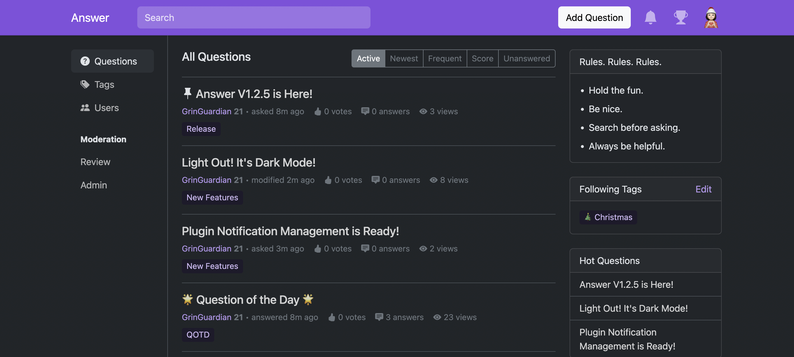
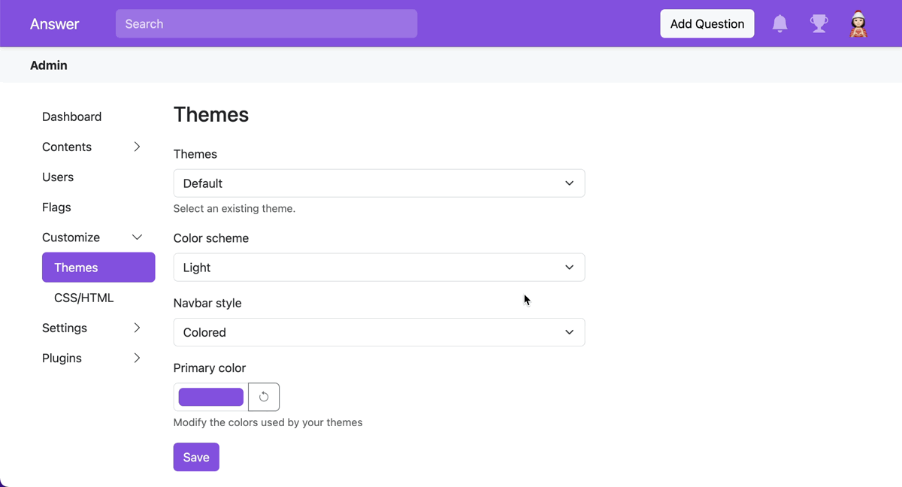
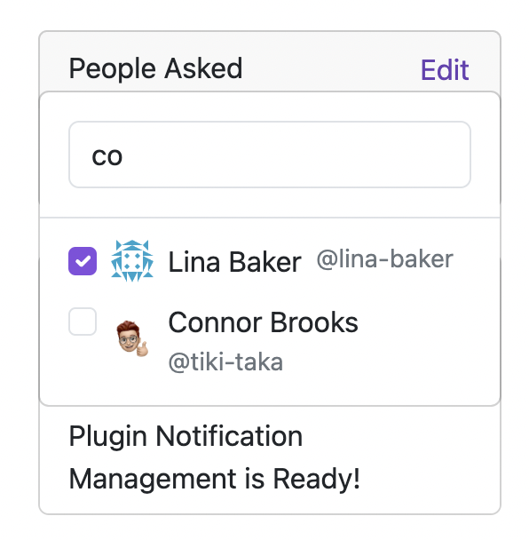
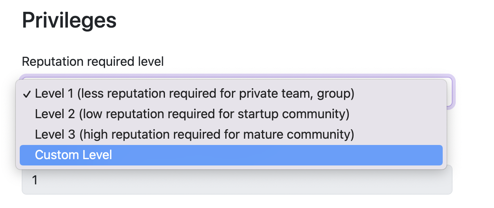
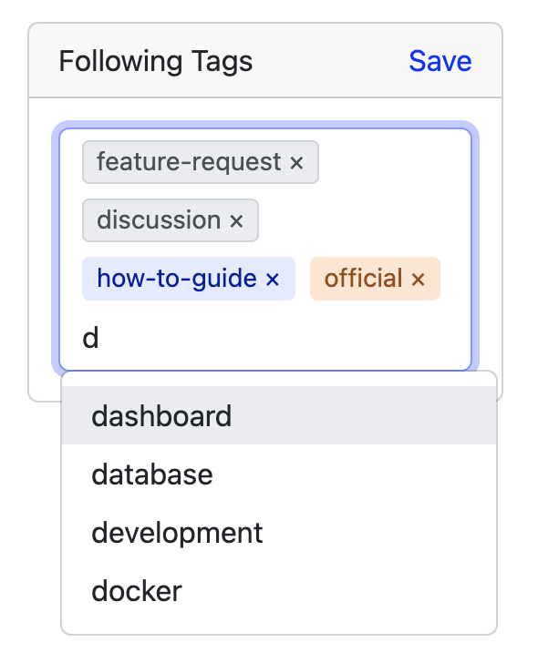

Spring is coming, and our monthly update is finally here! In this update, you’ll enjoy the coming community nights with Dark Mode, and manage third-party plugins' notification. There are new changes for better using and management experience, and we’re glad that they are ready for the stage. Check out [what’s new in Answer V1.2.5](https://github.com/apache/incubator-answer/releases/tag/v1.2.5) and the tutorials in this blog. 

## Turn the Dark Mode On
Get ready to explore the dark side with our new Dark Mode. Switch to light, dark manually to meet your needs, or follow the system for a smooth transition.

### How to
Admin can set default color theme for the users, here's how.
1. Go Admin — Customize — Themes
2. Color scheme, and choose Dark in the dropdown menu.

User can change the interface of color theme whenever they like.
1. Click avatar - Settings - Interface
2. Color scheme, and choose Dark in the dropdown menu.

## Plugin Notification Management
Now, users can always stay on top of the third-party plugin notifications, ensuring you stay informed across all your favorite tools. With Apache Answer, managing third-party plugin notifications has never been easier.

### How to
1. Click your avatar, and Settings.      

2. Click the name of the plugin.

## Exciting New Changes
As we embrace the new season, we also prepare some enhancements to existing features. Here’s a sneak peek for better knowledge sharing.

### Easier Invitation. Better Sharing.
The interface and interaction of invitation is refreshed. You can check invited users while add community member at the same time. 

### Customize the Reputation Score
There’s no one-size-fits-all rule, and it’s true when it comes to the community. You can familiarize with the reputation system first with default levels, and use custom level to fit your platform. Now, admins can customize the reputation score to keep the community engaged. 

### Tags. No Clutter.
Small tags are powerful. It’s the thread of the community, sewing similar content together for the users, while providing a neat garment for the admin. We make slight changes to make tags adding and searching fresh. 

## Big Applause to the Contributors
Raise your glass to [hgaol](https://github.com/hgaol), [sy-records](https://github.com/sy-records), [hbsciw](https://github.com/hbsciw), and [insistedMarin](https://github.com/insistedMarin) for their time and effort in this release. Shout out to every [translator](https://crowdin.com/project/answer/activity-stream). Special thanks to [lincolhzhou](https://github.com/lincolnzhou) for contribution to plugins. 

## We’d love to hear from you
What do you think of the releases? Anything you think it should be added to the roadmap?  What does your Answer look like? We’d love to hear from you about this release or anything else on your mind. Hit us on [X](https://twitter.com/answerdev), [Discord](https://discord.gg/a6PZZbfnFx), [GitHub](https://github.com/apache/incubator-answer), [Meta Answer](https://meta.answer.dev/), or the [mailing list](https://answer.apache.org/community). 