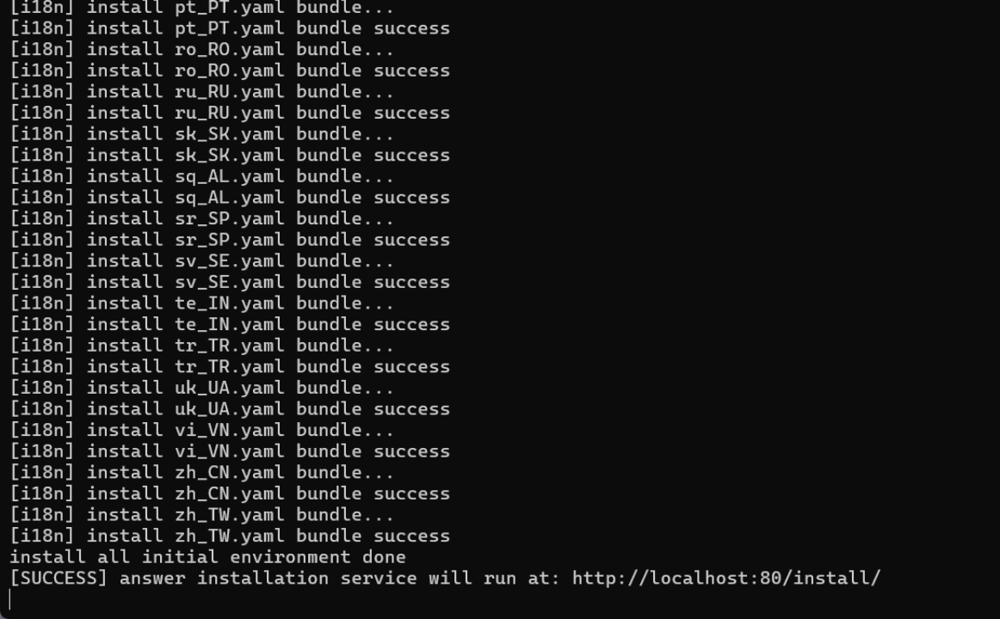
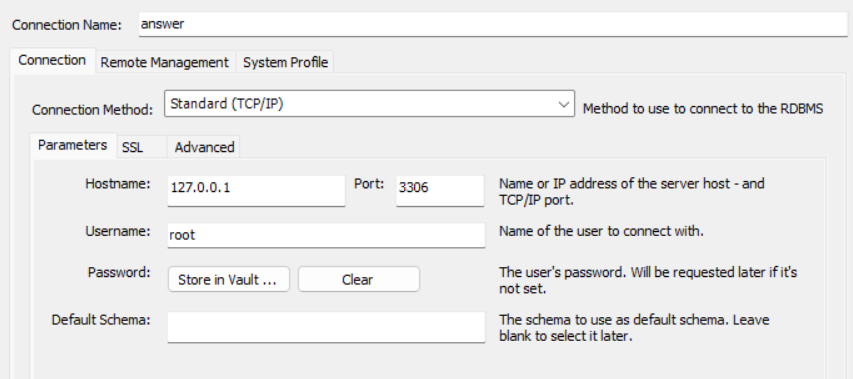
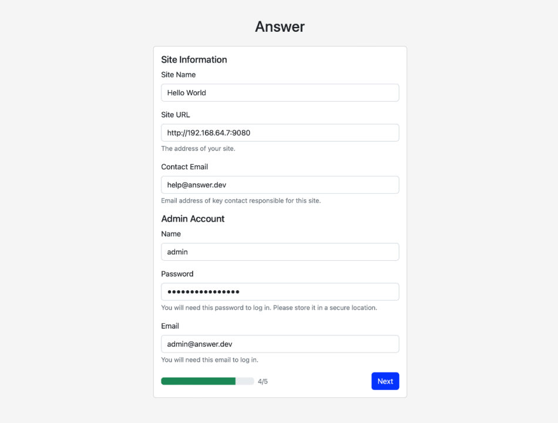
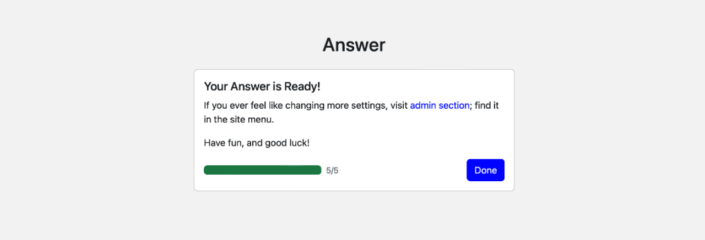
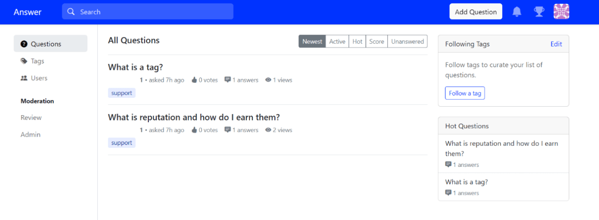

In the [Apache Answer Frontend Configuration Guide](https://answer.apache.org/blog/2024/08/16/apache-answer-frontend-configuration-guide), we believe that everyone was able to follow each step to complete the frontend configuration. This article will provide a detailed guide on how to configure the backend of Apache Answer. We will go through each step, ensuring that everyone can get started and run the backend successfully.

## Preparation

1. Download Golang
    Download and install the Go programming language from the [official website](https://go.dev/doc/install). Follow the default settings for installation.

2. Clone the Answer Project
    Ensure that you have cloned the Apache Answer project locally. If you haven’t done so yet, please refer to the [Apache Answer Frontend Configuration Guide](https://answer.apache.org/blog/2024/08/16/apache-answer-frontend-configuration-guide).


## I. Initialize the Project

Open the command line terminal in the root directory of the Answer project and run the following commands:
```
go mod download
go run cmd/answer/main.go init -C ./answer-data
```
_Note: If the first command doesn't work, try running the second one. The process may take some time, please be patient._


When you see [SUCCESS], means the operation has done. **Do not close this program at this time.** Enter the prompted URL `http://localhost:80/install/` in your web browser to open and proceed with the next step of the installation.

_Note: If you cannot find the localhost page when opening the URL, try running the following command first and then retry:_
```
cd ./ui
pnpm pre-install
pnpm install
pnpm build
cd ..
```


## II. Installation Interface

Open `http://localhost:80/install/`, and you will see the following interface. The first step is to choose the language.


### 2.1 Configure the Database

You can create an Answer database using your own database software.
Apache Answer supports MySQL, PostgreSQL, and SQLite as database backends. The smallest environment requirement is SQLite, which doesn't need any additional configuration.
If you plan to use MySQL or PostgreSQL, you need to **set up the database first** and then configure the database connection in this step.


**This article will use MySQL as an example.**

#### Create a Database

In the `MySQL command line`, create a database named `answer`:


#### Configure the Database Connection

Visit `http://localhost:80/install/`, and enter your database connection information in the installation interface:
- User name: root
- Database host: 127.0.0.1:3306
- Password: your database password


### 2.2 Create a Configuration File

In the installation interface, follow the prompts to create a `config.yaml` file.


### 2.3 Set Website Information and Administrator Account

Make sure to remember the website URL (e.g., `http://localhost`) and the administrator account information and password, as you will need them for future logins.


### 2.4 Complete the Installation



## III. Run the Backend

Back to the `command line terminal`, and in the root directory of the Answer project, run the following command to start the backend server:
```
go run cmd/answer/main.go run -C ./answer-data
```


## IV. Verify the Installation

In your web browser, visit the website URL you set up (e.g., `http://localhost`). Log in with your administrator account. If you see the following page, the configuration is successful:



By following these steps, you have successfully set up the Apache Answer backend. If you encounter any issues, feel free to communicate with our community members in the [community](https://meta.answer.dev/). We also warmly welcome you to [contribute to the community](https://answer.apache.org/community/contributing/) and work together to build a better Q&A platform.
