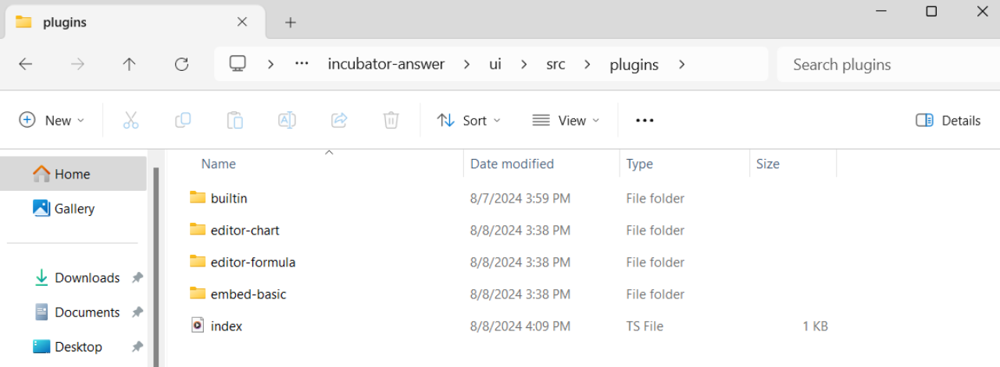

Plugins are like a set of building blocks that you can freely combine to create the functionality you want. Adding plugins is an excellent way to extend Apache Answer's features. This article will provide a detailed guide on the installation steps, helping you easily add plugins and master the process of installing and using them.

## Download Plugins

1. Click [here](https://github.com/apache/incubator-answer-plugins/tree/main) to download the desired plugin from the official Apache Answer plugin repository.
2. Place the Plugin: Move the downloaded plugin files into the `./ui/src/plugins` directory of your project.
3. Plugin Type Reference: https://answer.apache.org/docs/development/plugins

_Important: The folder should be named "plugins," not "plugin."_


## Install Standard UI Plugin

1. In the terminal, run `cd ./ui` to navigate to the ui directory.
2. Install dependencies: Run `pnpm pre-install`.
3. Start the project: Run `pnpm start` to launch the development server.
4. Backend Plugin Setup: In a new terminal window, continue with the backend plugin installation steps.

## Install Backend Plugin

1. Compile Frontend Code:
  - Linux/MacOS: Run `make ui`.
  - Windows: Run `pnpm install` and `pnpm build`.

2. Import Plugin: In the `cmd/answer/main.go` file, import the plugin (replace my-plugin with your plugin name):
```
import (
    answercmd "github.com/apache/incubator-answer/cmd"
    // Import the plugins
    _ "github.com/apache/incubator-answer-plugins/my-plugin"
)
```

The image below shows examples with the editor-chart, editor-formula, and embed-basic plugins.


3. Update go.mod: Navigate back to the project root directory by running `cd ..`. Use `go mod edit` to add the plugin to the go.mod file:
```
go mod edit -replace=github.com/apache/incubator-answer-plugins/my-plugin=./ui/src/plugins/my-plugin
```
Note: Windows users need to use double quotes, as shown below:
```
go mod edit -replace="github.com/apache/incubator-answer-plugins/my-plugin"="./ui/src/plugins/my-plugin"
```

Example with the editor-chart, editor-formula, and embed-basic plugins.


4. Download Dependencies: Run `go mod tidy` to download and update dependencies.
5. Start the Project: Run `go run cmd/answer/main.go run -C ./answer-data`.


Open the backend interface URL in your browser. Under the **Admin - Installed Plugins** section, you'll see the added plugins. Click the `⋮` in the Action column to activate or remove the plugin.

Congratulations, you've successfully added a plugin! Click [here](https://answer.apache.org/plugins/) to explore more community-built plugins. Additionally, we offer a detailed tutorial on [How to Package and Deploy Answer Plugins](https://answer.apache.org/blog/2024/07/02/how-to-package-and-deploy-answer-plugins/) and a [Plugin Development Guide](https://answer.apache.org/docs/development/plugins/) to make your Apache Answer even more powerful.
