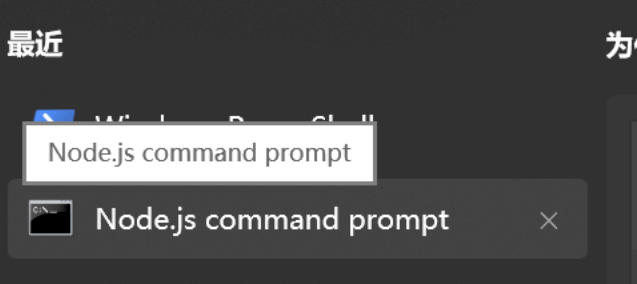
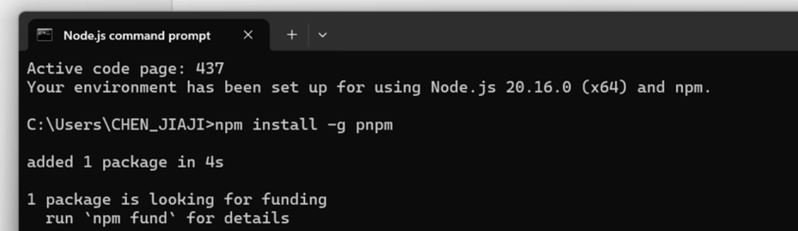

Our official website provides [Developer Guides](https://answer.apache.org/docs/development) to help developers quickly set up both the frontend and backend of Apache Answer. In today's blog post, we will break down the steps for configuring the frontend and backend in detail.

In the Answer community, we welcome and respect various [Contributing Methods](https://answer.apache.org/community/contributing/). Whether you're a developer or not, you can follow the steps outlined in the article to complete the Answer frontend setup.


### 1. Download Node.js and pnpm

Click [here](https://nodejs.org/en) to download Node.js, and select `Node.js runtime` during installation. It is recommended to install it in the default location.


After Node.js is installed, locate the `Node.js command prompt`.


Open the Node.js command prompt and enter `npm install -g pnpm`. If you see the following screen, it means pnpm has been successfully installed.

_Note: pnpm can be installed using various methods suitable for different operating systems. For more details, please refer to its official website._


### 2. Clone the Repository

Click [here](https://github.com/apache/incubator-answer) to visit the Apache Answer GitHub repository.


#### 2.1 Fork Answer Porject

Log in to your GitHub account and click 'Fork' to fork the entire Answer project.


#### 2.2 Install Git/Git Bash

Click [here](https://git-scm.com/downloads) and choose to download Git according to your operating system.


#### 2.3 Create and Configuratie SSH

You can browse GitHub's documentation on [connecting to GitHub with SSH](https://docs.github.com/en/authentication/connecting-to-github-with-ssh). You may skip the section in the documentation about generating a new SSH key for hardware security keys.

The following image shows the SSH key after configuration is complete.


#### 2.4 Clone Answer Project

In the Answer GitHub page, find the 'Code' section. Click to expand and copy the SSH address of the Answer repository


Next, open `Git Bash` and enter the following command to clone the project.
```
git clone <Answer SSH address>
```
As shown in the image below, after completing this step, the project will be successfully cloned to your local folder.


### 3. Install Dependencies and Build Local Packages

We will refer to the Answer project folder as the root directory. Open the `command line terminal` and run the following commands, then navigate to the `ui` subdirectory from that directory.
```
cd ./ui
pnpm install
```

**Note: For Windows users, you might encounter the following error:**

This issue is caused by system permissions. You can first enter the following command:
```
Set-ExecutionPolicy -ExecutionPolicy RemoteSigned -Scope CurrentUser
```
This command sets the PowerShell execution policy for the current user to `RemoteSigned`, which means local scripts can run, while remote scripts must be signed.

Then you can run it successfully. Once completed, it indicates that the installation is finished.


### 4. Run the Frontend

After configuration is complete, navigate to the `ui` folder and enter `pnpm start` to run Answer.


Congratulations! You have completed the frontend configuration for Answer. If you have any questions, feel free to join our [community](https://meta.answer.dev/) and engage with our team.