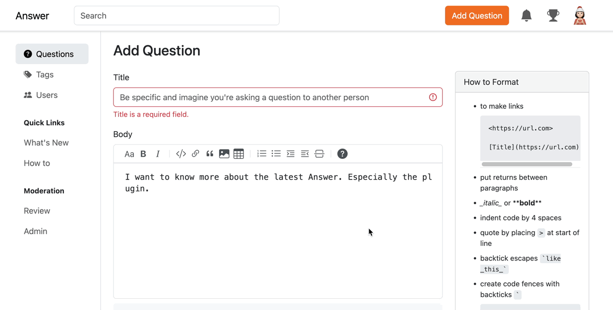

Build a thriving community, while making it a safe place for everyone to express themselves freely, is a dream and a challenge. Answer 1.3.1 is here for these two goals. 

In this version, we add new tool for admin to define keyword lists to identify and review specific content beforehand, ensuring a safe space for everyone. Users can also mention the admin and moderator in comments of a post to seek response actively. New Captcha plugins are ready to safeguard your community. 

Ready to [upgrade](https://answer.apache.org/docs/upgrade)? Leave us several minutes to dive in.

## What’s New
### Keyword Censorship for Secure Communities
Apache Answer is for open knowledge exchange and discussion respectfully. Keyword censorship helps achieve this by proactively filtering out offensive, discriminatory, or harassing content. It ensures a platform where everyone feels comfortable expressing themselves freely.
Here’s how it works.
1. Admin can develop a keyword list of the community to check or filter.
2. Then, go **Admin -\> Plugin -\> Review Basic** where you can add these keywords in **Review** post keywords or **Disallowed** post keywords based on your need. One keyword or IP address per line. Scroll and click **Save**.  
	
3. Content, IP addresses, or browser identifiers that contain any of these words will be sent to the review queue or deleted. It will match the internal words. For example, if "alpha" is not allowed, then "Alphabet" is also not allowed.  
    

This feature would allow administrators to review or filter out specific words or phrases, potentially creating safe spaces for younger audiences or communities with content restrictions.

### Tag Moderators and Admin in Comment
Now, you can mention moderator or admin in a comment of a post. As you type the first letter of the moderator or admin's username, a search bar will appear. Select the admin/moderator from the dropdown list for a faster response. 

The moderator and admins will receive an email in their email box.

### Shining on Social Platforms
Social media meta tag is on the stage! Let’s make your shared content appears more attractive on social media platforms. Social meta tags use the following defaults:
* Title: the title of current page
* Image: the logo of the site

Share it and don’t forget to mention us on [Twitter](https://x.com/AnswerDev). 

## Improvements and Fixed Bugs
We’ve got new plugins for you: [Captcha Basic](https://github.com/apache/incubator-answer-plugins/tree/main/captcha-basic) and [Captcha Google V2](https://github.com/apache/incubator-answer-plugins/tree/main/captcha-google-v2). These two plugins enable or disable the CAPTCHA feature, allowing users to implement their CAPTCHA plugins, such as Google reCAPTCHA.

We also add auto-scroll for posting so that you can jump right to the blank space for you to edit it. 

Find out more in our [Release note](https://github.com/apache/incubator-answer/releases/tag/v1.3.1).

## Thanks to the Community.
This version is proudly presented by 8 contributors from the community, and they are:
[kumfo](https://github.com/kumfo), [hgaol](https://github.com/hgaol), [LinkinStars](https://github.com/LinkinStars), [robinv8](https://github.com/robinv8), [shuaishuai](https://github.com/shuashuai), [sy-records](https://github.com/sy-records), [zahash](https://github.com/zahash), and [prithvidasgupta](https://github.com/prithvidasgupta).

## We Love Feedback
We'd love your feedback! Share your thoughts on the latest releases, suggest features you need, or just send us messages. Please don't hesitate to reach out on [X](https://twitter.com/answerdev), [Discord](https://discord.gg/a6PZZbfnFx), [GitHub](https://github.com/apache/incubator-answer), [Meta Answer](https://meta.answer.dev/), or our [mailing list](https://answer.apache.org/community/support).
