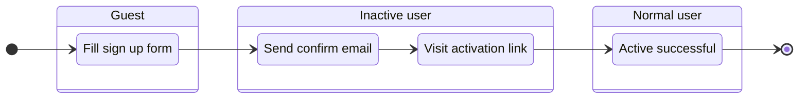

# Users

Show top users in the platform.

- **Users with the highest reputation scores this week**
  - Users who increased the most reputation this week
  - Show top 20 users with their increased reputation (order)
- **Users who voted the most this week**
  - Number of votes cast for others
  - Show top 20 users with their number of votes (order)
- **Our community staff**
  - Show all moderators, administrators
  - Ordered by reputation

## Sign up

A user wants to sign up from Email.

- Display name (abbreviated as "name"):
  - Less than 30 characters.
- Username:
  - Unique.
  - Less than 30 characters.
  - Can only contain `0-9`, lowercase letters `a-z`, symbols `- . _`.
  - Generated based on the display name, spaces are replaced with symbols `-`.
  - If there is a repetition, add 4 random characters at the end, e.g. `joe-x7k2`.
  - Reserve keywords are not allowed.
- Record the time of registration and the IP address.
- The activation link is valid for 14 days.
- The user's initial reputation is `0`, after activation the reputation becomes `1`.

## Log in

## Reset password

## Notification

## Achievement

## Profile

## Settings

## Unsubscribe email
