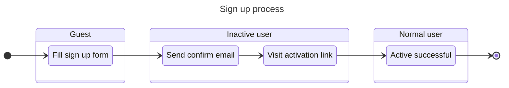
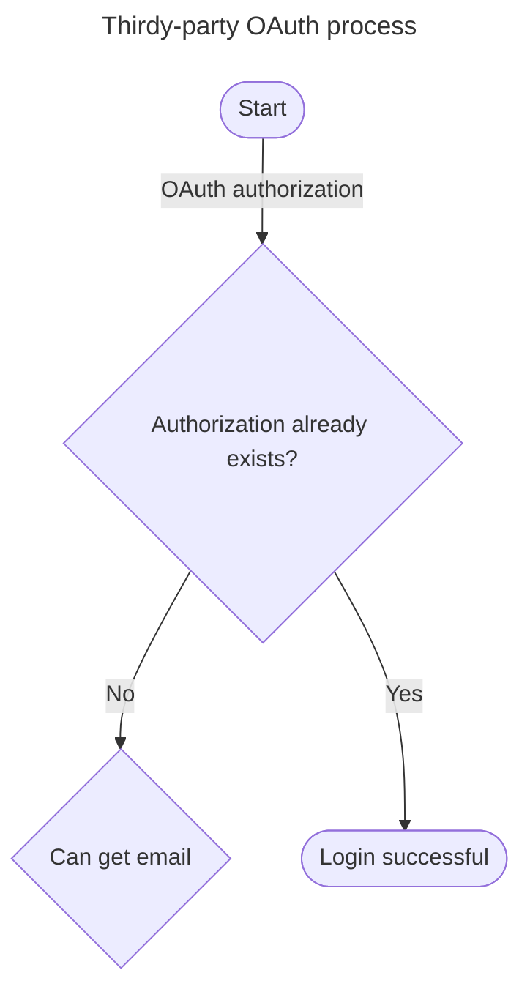

# Users

## Top users

Show top users in the platform.

- **Users with the highest reputation scores this week**
  - Users who increased the most reputation this week
  - Show top 20 users with their increased reputation (ordered)
- **Users who voted the most this week**
  - Number of votes cast for others
  - Show top 20 users with their number of votes (ordered)
- **Our community staff**
  - Show all moderators, administrators
  - Ordered by reputation

## Sign up

A user wants to sign up from email.

- Display name (abbreviated as "name"):
  - Less than 30 characters.
- Username:
  - Unique.
  - Less than 30 characters.
  - Can only contain `0-9`, lowercase letters `a-z`, symbols `- . _`.
  - Generated based on the display name, spaces are replaced with symbols `-`.
  - If there is a repetition, add 4 random characters at the end, e.g. `joe-x7k2`.
  - Reserve keywords are not allowed.
- Record the time of registration and the IP address.
- The activation link is valid for 14 days.

## Log in

A user wants to log in. The user's login permissions are related to the status.

| User status | Normal | Inactive | Suspended | Deleted |
|---|---|---|---|---|
| Log in | Allow | Denied | Denied | Denied |

### Log in with email and password

- Fill email and password to log in.
  - If the user does not exist, the message "Invalid email or password" is displayed to prevent the account from being attacked.
  - When an inactive user logs in, go to the page that asks for activation.
  - When an suspended user logs in, go to the ban prompt page.
- Login status is remembered for 14 days by default.
- Click "Forgot password" to reset password if someone forgot their password.

### Log in from thridy-party OAuth

## Reset password

TODO

## Notification

TODO

### Inbox

TODO

### Achievement

TODO

## Profile

TODO

## Settings

TODO

### Unsubscribe email

TODO
