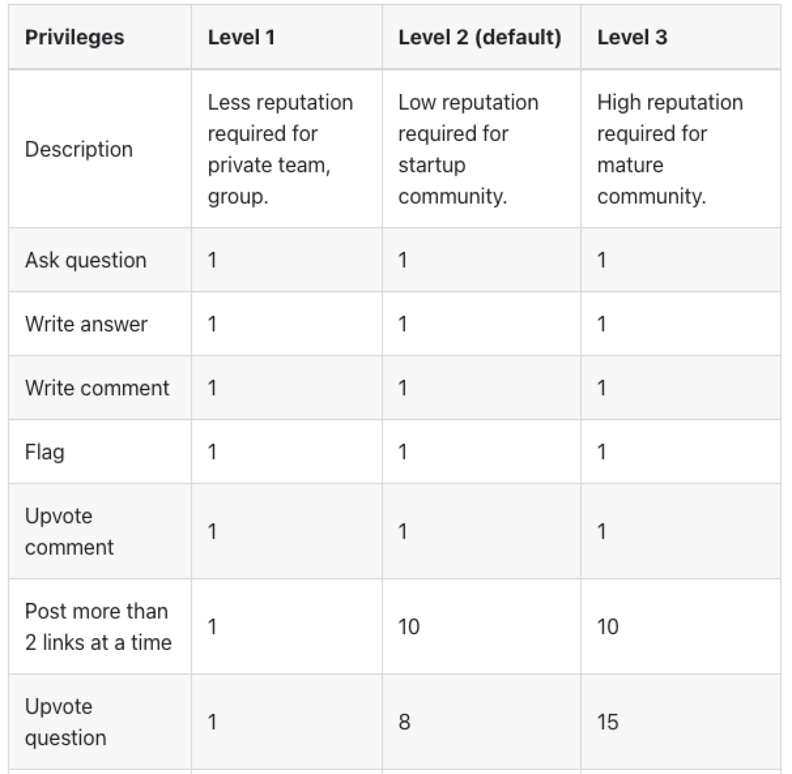

Once your team starts using Answer, you’ll gradually accumulate a centralized knowledge hub where team members share, exchange and collaborate freely. For admins, they have to maintain a vibrant ecosystem is great, while ensure content management system is efficient. In Answer, everyone is a loop in content management, that’s why we have these features: **Flag, Moderation, Permission, and Reputation**. Find out how they work in harmony to elevate the online community experience.

## Flag: Everyone is a Part of it

A vibrant community is about trust, and Flag is a reflection of this. In Answer, we put the safety and well-being of the community in the hands of all community members. With flag, users can flag content that violates community guidelines immediately.

Admin can check flagging content in **Admin-Flags**. Answer provides filters for different flagged content so that the admin can focus on a flagged content type once at a time.

After checking the content, the admin can click Review to decide on further action.

Flag is not merely a way to report inappropriate content to the community, but a smart and effective way to maintain a respectful environment with collective responsibility.

## Reputation: Contribution and Recognition

The reputation system incentivizes users to participate and contribute to collective knowledge. In Answer, the reputation score is right next to the user’s name, which is a badge of presenting one’s credibility, reliability, and expertise.

Most of the reputation is related to positive action or content, such as your question or answer is upvoted, your answer is accepted, or you accept someone’s answer, etc.

We automate the [reputation system](https://answer.apache.org/docs/recipes/contents/reputation) for an easy and productive community management, and you can start [here](https://answer.apache.org/docs/installation) to give it a go.

## Permission: Customizing Content Engagement

With more reputation scores, community members gain both recognition and **privileges** to participate in content management of the community. In Answer, we have [3 privileges systems](https://answer.apache.org/docs/recipes/contents/permission) for communities at different scales. For example, a community member wants to upvote a question, it takes different reputation scores. For a private team, it requires 1 reputation score, while in a startup community, it requires 8.

Admin can always change the privileges level in Admin settings based on current community status.

This personalized approach encourages diverse engagement levels, ensures both newcomers and experienced contributors with the right permissions. It fosters an inclusive atmosphere where everyone's voice is valued.

## Moderation: Collaboration and Safeguard

Trusted members are a part of the content management loop, ensuring content quality and adherence to guidelines. Though Answer grants active users who stick to the community rules the authority to manage and oversee content within the community, admins still needs to review edits from users with less reputation scores.

## Conclusion

Whether you're a community starter seeking to learn, or a community expert willing to share knowledge, Answer's content management tools are intuitive, efficient, and reliable. You can explore how the Answer team apply this system in the [community](https://meta.answer.dev/), or start knowledge sharing and managing with [Answer](https://answer.apache.org/docs/installation) today and manage the content at ease.
