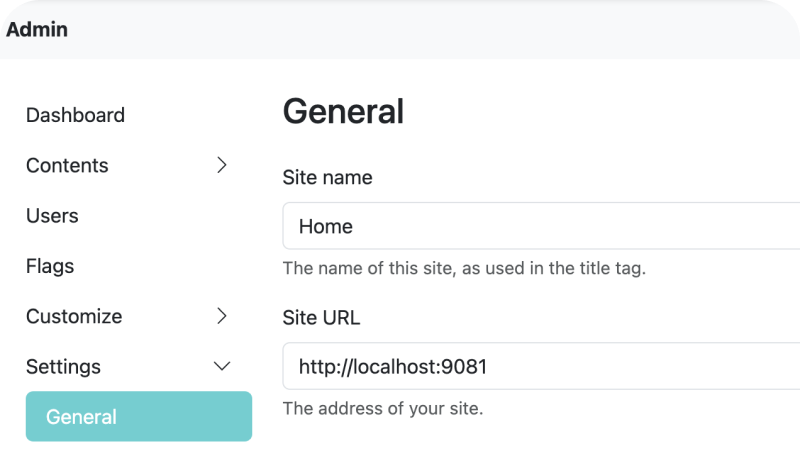
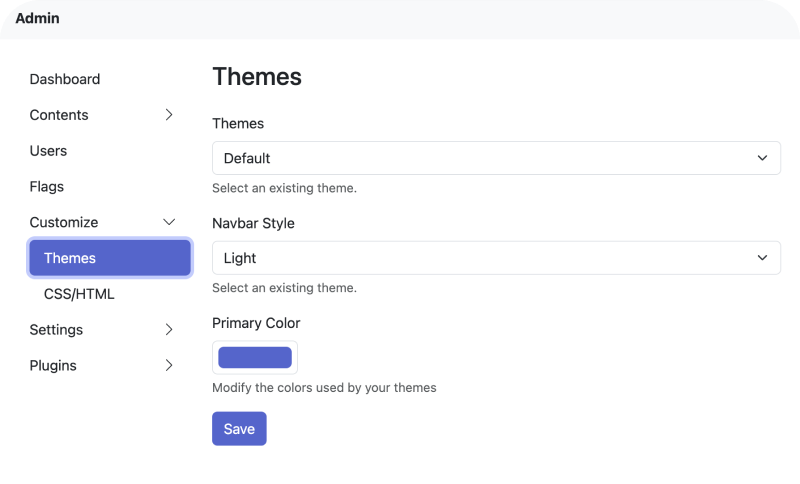
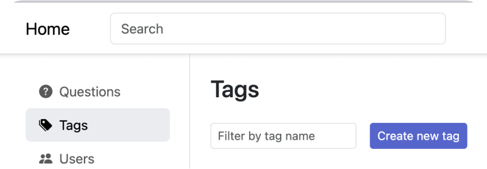
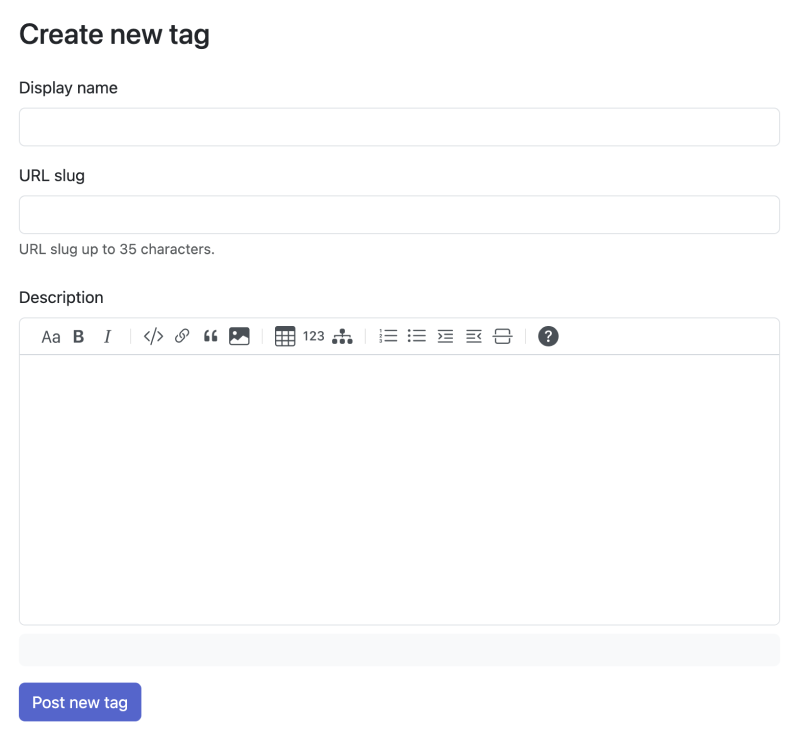
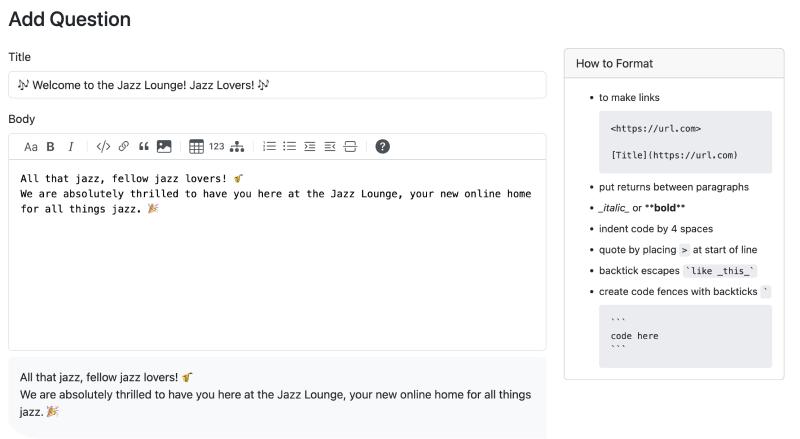

Q&A is one of the most effective ways to obtain knowledge, build connections, and create interaction. You can also find the trail of Q&A format in a support center, forum, and knowledge base which allows you to dive in any topics. It streamlines communication and information, making it an efficient format to run an online community.

Having the idea of running an online community is remarkable, but don’t step back when thinking to make it happen in the reality. In today’s read, you’ll set up and launch your online community in just 4 steps with Answer.

## Customize Your Branding

Your branding is unique, so is your community. Let’s personalize **name, color scheme and logo** to align with your brand freely while.

Greet your users with a distinct logo, color scheme, and visual elements that echo your idea of a community. Make sure they are consistent in design, which helps your members recognize and memorize it easily. Here’s how to customize them in Answer.

### Community Name

1. For admins, go to the left side of the page and click **Admin**.
2. Settings \> General
 
You can also fill the site URL, provide a description, and leave a contact email for your Answer.

### Logo

1. For admins, go to the left side of the page and click **Admin**.
2. Settings \> Branding
 
The logo will be displayed at the top left of the page, and make sure to follow the dimensions on the Branding page before uploading it.

### Color Theme

1. For admins, go to the left side of the page and click **Admin**.
2. Customize \> Themes
 

In Answer, we provide 2 different navigation bar styles: **Colored and Light**. You can find out the difference with the image below.

## Get Your Users on Board

Make sure your users have a smooth onboarding process by offering them a warm welcome, resources, and guidance. Here’s how Answer helps.

### Add Users in Bulk

In Answer [v1.1.2](https://github.com/apache/incubator-answer/releases/tag/v1.1.2), admins can add new users in bulk. You can set name, email, and password for them in one place. Here’s how.

1. For admins, go to the left side of the page and click **Admin**.
2. Users > Add user
3. Follow the format instruction to add users.
    

### Community Layout

In Answer, you can use CSS and Html to customize the home page. For example, personalize the sidebar to add shortcuts for your users. Find out how Answer users do that in [our community](https://meta.answer.dev/questions/D1xc/how-can-i-display-quick-links-in-the-side-nav), and you are always welcome to ask and contribute here.

Besides shortcut, you can also place community rules on the home page to notify everyone to keep a respectful and friendly atmosphere.

## Create Interesting Content

Engage users with diverse topics and discussions, and encourage them to post their first questions. But before that, let’s start with adding a few new tags, which are helpful to manage the content later on.

### Build Some Tags

Your community will become larger, both at user scale and content scale. Start adding some tags as the basics of your content structure, enabling your users to create content while adding the tags at the same time.

1. For admin and moderator, click **Tags** on the left sidebar.
2. Create new tag.
 
3. Add information for the tag to help your users understand better.
 

### The First Post is Easy

Now that the tags are ready, let’s have the very first post by clicking **Add Question**. It is recommended to include **a welcome message, introduction, community guidelines** in the first post to get your users to understand your community better. Besides, you can add goals and upcoming plans, and encourage users to post, answer, and engage in the community. In Answer, adding a new post is easy.

1. Click **Add Question** in the upper-right corner.
2. Edit your post, and follow **How to Format**. Answer provides real-time preview before you officially post it.
 
3. Always remember to add a tag before posting it.
4. Post your question, and you are good to go.  

### Time to Manage the Content

Admin and moderators can review and edit the posts to maintain a vibrant environment for everyone. That’s not it, in Answer, everyone is a part of content management. You can find Flag, Moderation, Permission and Reputation, find out how they better online community experience for your users in our [blog](https://answer.apache.org/blog/2023/08/09/how-to-manage-content-system-efficiently-with-answer).

## Engage and Award Your Users

Diverse topics and high-quality discussion are both good content to engage users. In Answer, [reputation](https://answer.apache.org/docs/recipes/contents/reputation) score to reflect user’s credibility. Community members gain reputation scores by adhering to community guidelines and continuous contributions. When community members recognize someone as a reputable contributor, they are more likely to value their opinions. This way, more users see the community is a home for respected and well-behaved users, they are more likely to be a part of the community.

Reputation scores are also used by community moderators and administrators to determine user [privileges](https://answer.apache.org/docs/recipes/contents/permission), such as posting more than 2 links at a time, creating a new tag, etc. Answer provides 3 levels of reputation, and you can choose a level based on your needs. Explore more on how to utilize reputation and privilege in your online community [here](https://answer.apache.org/blog/2023/07/19/how-to-utilize-reputation-and-privilege-in-online-community/).

From customizable features to engagement, Answer equips you to connect with your users in meaningful ways. Whether you're launching a new community or looking to revitalize an existing one, Answer got practical features you need to make your online community a home for your users. Start building your community like the pros with [Answer](https://answer.apache.org/) today, and watch it flourish into any communities you dream about.

