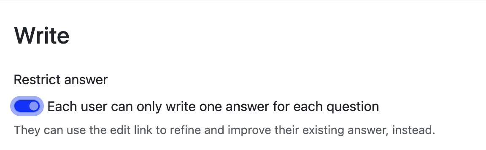
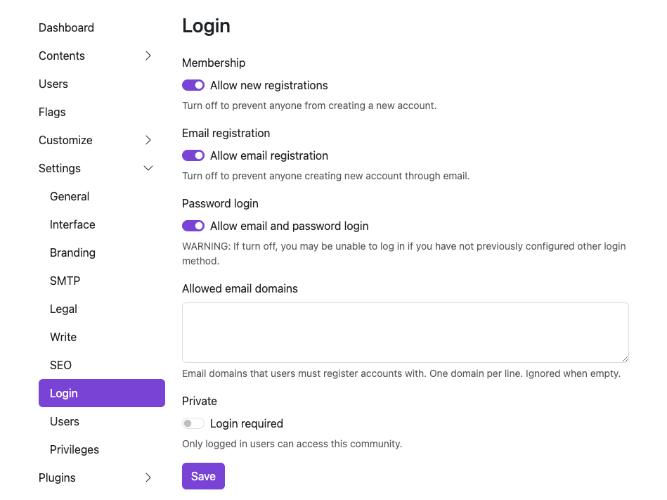
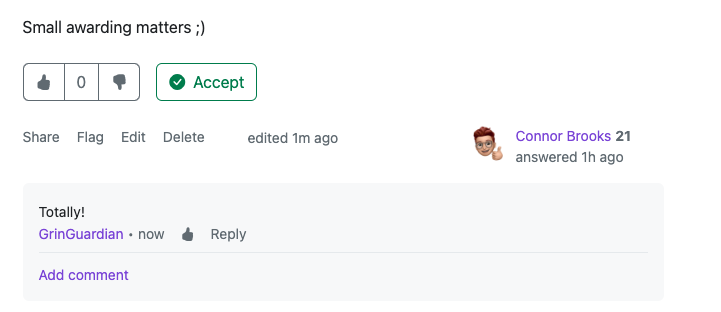
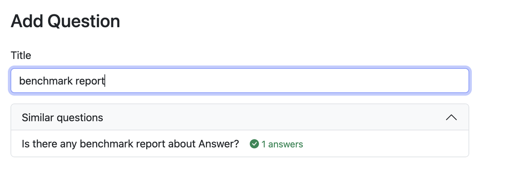

Happy new year, everyone. We all have new questions or new answers at the beginning of the year, and feel free to raise your hand in the first release of Answer in 2024.

In this version, we pack up new features and improvements to make finding answers easier, reduce duplicate content, and an efficient way of organizing your Q&A knowledge from the very start. 

## One Answer. One Question.
Answer focuses on clear and concise answers to each question. However, you can find new answers or scattered answers from one person in several responses, making it hard for the admin to pick the best answer, and maintain the content afterwards. 

We've streamlined things so everyone can write or edit one, top-notch answer to each question. This helps users focus on contributing their expertise, and lets the best answer shine.

### How to
This feature is on by default, and admin can switch it off anytime. 
1. Go Admin - Settings - Write.
2. Switch the button.

If a user went back to an answered question, the page will prompt them to edit their exisitng answer instead of adding a new one. 

If the button is switched off, there'll be 2 options provided. Once user clicked Add another answer, there'll be a  pop-up window shown, suggesting user to edit previous answer.

## Admin Takes Control of Access
We heard the voice of the [community](https://github.com/apache/incubator-answer/issues/565), and valued the privacy and security of a Q&A platform. Now, admins have the access to disable the default password login form, having more control over who can and how to access the platform.

### How to
1. Admin - Settings - Login
2. Switch off the Password login.
Turning off this option might lock you out if you haven't set up another way to log in. A friendly reminder to add a backup login option here.

## Tweaks. Fixes. Improvements.
Sometimes, a small change can make a difference to your knowledge journey, and here they are. 

### Clearer Space for Comment and Answer
The comment used to be blending in a bit before. Now with the grey shadow behind, you can easily identify the answer and comment.  

### Synonym Support for Tag Search
We all have abbreviations or nicknames for some tags, and now you can add synonyms for a single tag.

Next time, feel free to search for the tag in the tag page, or the post page easily without recalling the exact names of the tag.

### Powered Up Dashboard
Share or tuck your Answer away by choosing the running **Public/Private** mode. Database version and size info are ready for your glance, while you can easily access different resources in Answer links.

### Faster Discovery of Similar Questions
We're refining how you experience similar questions. To bring you more focused answers, we'll wait until you've typed at least 10 characters. Then we'll showcase fresh results when any appear. Hit the existing questions and get the answer without repetitive editing. Set both users and admins' hands free.  

## Cheers. Contributors.
We stand with the community, and received lots of support. Whether a bug reporting, solution discussion, or hands up for a task, this update gathers the power of the community. 

Cheers to the lovely contributors (🥁drumrolls here), and you rock this release.
[kelvinkuo](https://github.com/kelvinkuo), [hgaol](https://github.com/hgaol), [LinkinStars](https://github.com/LinkinStars), [shuaishuai](https://github.com/shuashuai), [sy-records](https://github.com/sy-records). 

Big applause to our lovely [translators](https://crowdin.com/project/answer/activity-stream) who pave the way to knowledge palace to more people. We surely can't forget people who provided suggestions, reported issues, and cheered us on. You are the heart of Answer. 

Dive into the [update](https://github.com/apache/incubator-answer/releases/tag/v1.2.1) and experience the latest Answer for yourself, and you're always welcome to [join the community](https://answer.apache.org/community/about).