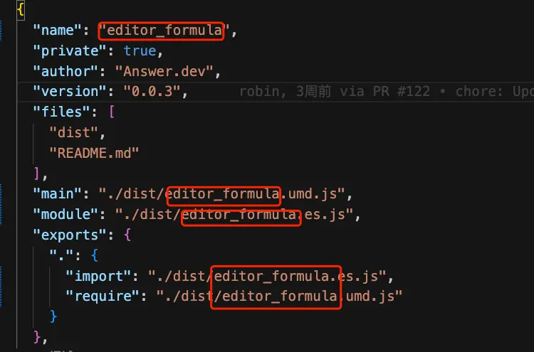
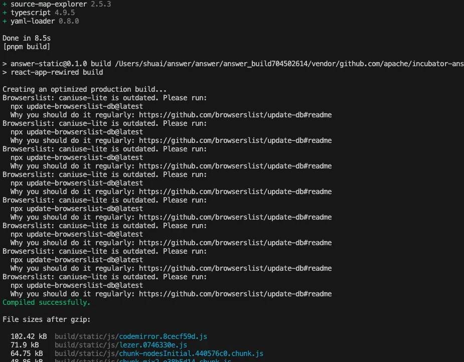
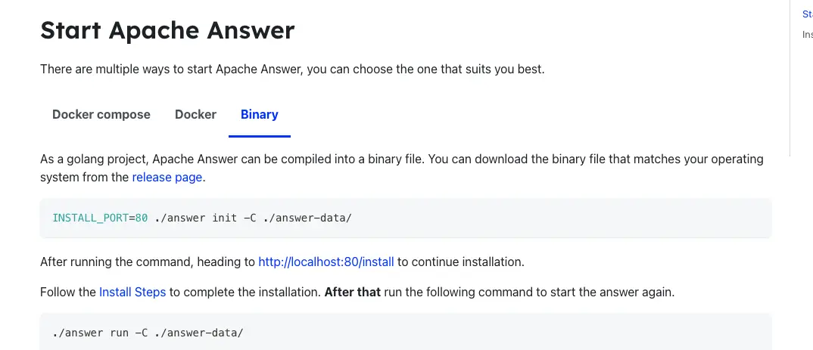
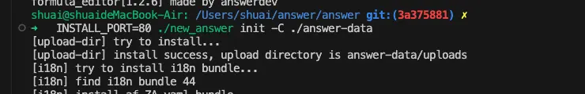

在最近的的社区反馈中，部分用户反馈在使用 Answer 插件的过程中，不知道如何将插件打包进入 Answer 系统中，[Answer 插件构建文档](https://answer.apache.org/docs/plugins/)中也没有提示正确结果的示例，所以对于一些非专业的开发者造成了一些困扰，所以本篇将作为一个详细教程，来手把手教会你正确打包 Answer 插件。

### 开始之前

在开始之前，请确保您已经配置好了基础的开发环境，包括 Node.js、pnpm、Docker、Go 等。同时，请确保您已经阅读了官方的[开发环境配置文档](https://answer.apache.org/docs/development)。

### 注意

**如果使用的是最新的代码这里可以直接跳过**

在 1.3.5 版本中，对插架的构建流程及部分插件的命令有所调整，如果你用的是 1.3.5 版本之前的代码，需要更改部分插件内部的基础信息。具体涉及到的插件有：

1. editor-chart
2. editor-formula
3. embed-basic (该插件 1.3.5版本后才有）

更改的[commit id](https://github.com/apache/incubator-answer-plugins/commit/e224fee9b8a0b936e143e852050d9345aa249201), 需要将对应的插件的 `package.json` 文件中的插件名称的 '-' 替换成 '_'， 例如：


## 一：构建包含插件的镜像

构建包含插件的 docker 镜像有两种场景：
1. 基于官方基础镜像构建
2. 基于本地代码构建

### 基于官方基础镜像构建

如果您不需要对 Answer 的源码进行调整，可以直接基于官方基础镜像构建。具体步骤请参考[官方文档](https://answer.apache.org/docs/plugins/#build-with-plugin-from-answer-base-image)构建带有插件的 Docker 镜像，本文不做演示。

### 基于本地代码构建 Docker 镜像总体步骤
如果您对 Answer 的源码有调整，需要基于自己修改的代码进行构建。请保持本地代码最新，以下是总体步骤：

1. **添加所需插件**：在根目录的 `/script/plugin_list` 文件添加所需要的插架仓库，每行一个
2. **构建 Docker 镜像**：运行 `docker build -t <image_name[:tag]> .` 命令开始构建镜像。
3. **本地启动，验证插件是否正确运行**：等待构建完成后，运行 `docker run -d -p 9080:80 -v answer-data:/data --name <container_name> <image_name>`命令，进行验证。

### 1.添加所需插件
```
github.com/apache/incubator-answer-plugins/connector-basic@latest
github.com/apache/incubator-answer-plugins/reviewer-basic@latest
github.com/apache/incubator-answer-plugins/captcha-basic@latest
github.com/apache/incubator-answer-plugins/editor-formula@latest

```

### 2.构建 Docker 镜像

构建需要一定时间请等待构建完成


### 3.本地启动，验证插件是否正确运行

运行下面命令启动，[根据文档](https://answer.apache.org/docs/installation#install-steps)完成初始化, 登录管理后台激活插件，查看插件是否正确运行。

```
docker run -d -p 9080:80 -v answer-data:/data --name answer101 answer-plugin
```

初始化完成后，登录你的网站访问管理后台，激活插件，查看插件是否正确运行即可。

管理后台


激活插件：


确认对应插件（editor-formula）的是否正确运行：


## 二：构建包含插件的二进制

下面将指导您如何构建包含特定插件的 Apache Answer 二进制文件。这个过程包括构建基础二进制文件、将所需插件包含在内、本地验证插件以及最终部署该二进制文件。

### 二进制总体步骤

1. 构建基础二进制文件
2. 利用基础二进制文件构建所需插件的二进制文件.
3. 本地验证插件
4. 部署该二进制

### 1.构建基础二进制文件

首先使用 `make ui` 命令构建前端静态资源。

效果：
1. 安装依赖

2. 依赖安装完成开始构建静态资源


然后使用 `make build` 构建基础二进制文件，运行成功会在项目根目录生成 answer 二进制文件，该过程中如果出现 go 的依赖安装失败的提示，可以本地尝试运行 `go mod download`，查看是否能够安装成功，如果仍然失败，请考虑配置国内镜像： https://goproxy.cn/，或者开启网络代理。

成功结果：


### 2.利用基础二进制文件构建包含所需插件的二进制文件

参考 [Answer 文档](https://answer.apache.org/docs/plugins/#binary-build)
```
# answer build --with [plugin@plugin_version=[replacement]] --output [file]
$ ./answer build --with github.com/apache/incubator-answer-plugins/connector-github

# build a new answer with github login plugin then output to ./new_answer.
$ ./answer build --with github.com/apache/incubator-answer-plugins/connector-github@1.0.0 --output ./new_answer

# with multiple plugins
$ ./answer build \
--with github.com/apache/incubator-answer-plugins/connector-github \
--with github.com/apache/incubator-answer-plugins/connector-google

# with local plugins
$ ./answer build --with github.com/apache/incubator-answer-plugins/connector-github@1.0.0=/my-local-space

# cross compilation. Build a linux-amd64 binary in macos
$ CGO_ENABLED=0 GOOS=linux GOARCH=amd64 ./answer build --with github.com/apache/incubator-answer-plugins/connector-github

# specify the answer version using ANSWER_MODULE environment variable
$ ANSWER_MODULE=github.com/apache/incubator-answer@v1.2.0-RC1 ./answer build --with github.com/apache/incubator-answer-plugins/connector-github
```

可以根据文档上的提示来选择所需要的插件,打包插件的会重新构建前端静态资源，插件可能有特有的依赖项，所以这里会重新执行依赖安装跟构建。构建成功后会在更目录生成 `new_answer` 二进制文件。

eg:


#### 2.1.打包单个插件

`./answer build --with github.com/apache/incubator-answer-plugins/connector-github`

效果：





命令验证插件安装 `./new_answer plugin`


#### 2.2.使用本地插件代码构建单个插件

如果需要调整插件的一些信息或者使用自己实现的私有插件来构建，需要使用 `with local plugins` 命令来构建，比如上面提到的 `editor-formula` 插件，并且使用的 Answer 代码版本是小于 1.3.5 的，所以需要调整插件的一些信息，这种情况就需要使用该命令来完成构建。

`./answer build --with github.com/apache/incubator-answer-plugins/editor-formula@0.0.3=/Users/shuai/answer/plugins/editor-formula`

结果：


命令验证插件安装 `./new_answer plugin`


#### 2.3.打包多个插件

效果及过程与上面两个类似，请自己实验安装，这里不在展示。


### 3.本地验证插件
 
使用命令行验证只是确保插件已经打进去了，想要查看插件是否能正常运行，可以本地运行生成的二进制文件进行查看，二进制运行[文档](https://answer.apache.org/docs/installation)
, 按照文档步骤初始化完信息。注意这里需要运行的是 new_answer 二进制，所以命令行中的 ./answer 需要使用 ./new_answer

### 4.本地验证步骤

1. 完成初始化

例如： `INSTALL_PORT=80 ./new_answer init -C ./answer-data`



成功后访问 `http://localhost:80/install/`，按照[文档](https://answer.apache.org/docs/installation#install-steps)完成初始化步骤。

2. 运行命令 `./new_answer upgrade -C ./answer-data/` 更新信息
3. 启动本地网站 `./new_answer run -C ./answer-data/`， 访问 `http://localhost/`，登录进去，访问 `http://localhost/admin` 开启插件，验证插件是否生效。

这里使用最后打包的 editor-formula 插件作为示例。


到这一步就可以确定插件是否正确构建并运行了。

### 5.部署该二进制

如果你的网站是使用的二进制进行的部署，那么你现在就可以将该二进制文件进行部署了，如果需要适配不同平台，可以使用文档上面的交叉编译命令来构建二进制文件。

