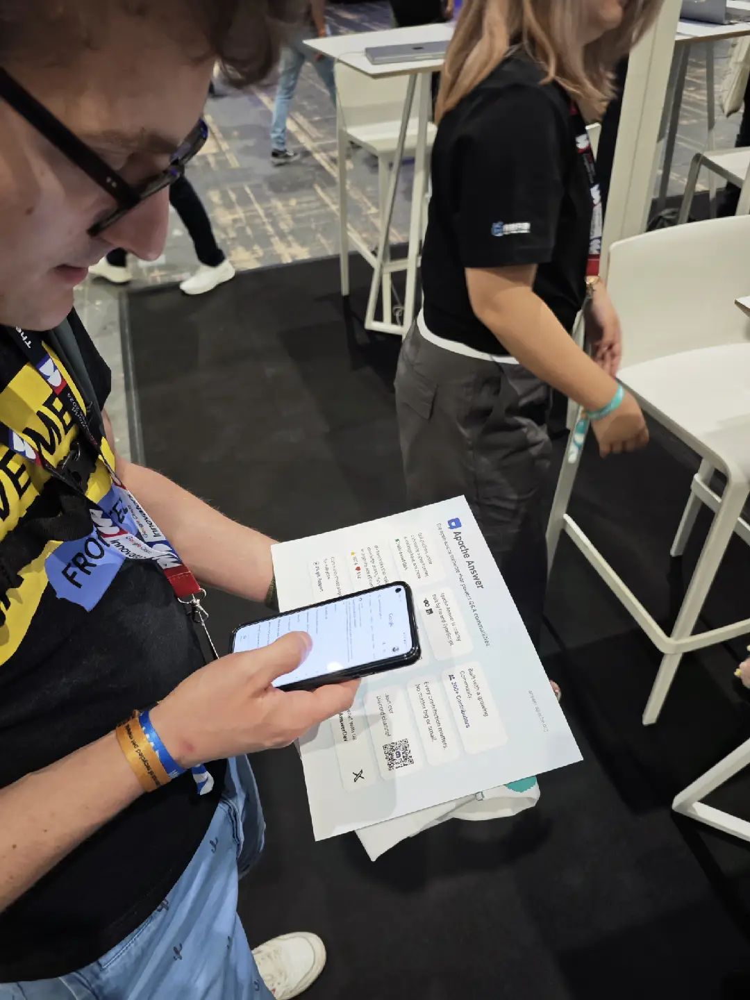

July was a month filled with community and connection. We had the privilege of participating in two incredible events: [WeAreDev World Congress 2024](https://www.wearedevelopers.com/world-congress) and [CommunityOverCode Asia 2024](https://asia.communityovercode.org/).

We were grateful to be given these chances. In this blog, we would love to share tips here for more open-source projects showcasing themselves on the stage next time. 

## WeAreDev World Congress GitHub Open Source Spotlight 
As world’s leading event for developers and tech decision-makers, WeAreDev World Congress welcomes more than 15,000 developers and over 500 speakers sharing their expertise and visions of future trends in modern software development. 

This year, GitHub Open Source Spotlight was a part of this congress. We submitted our application and were chosen and offered a space at GitHub booth. It was an unbelievable opportunity to showcase Apache Answer to a global audience of over 15,000 developers and tech leaders. Not to mention, with other brilliant open-source projects. 

The event provided a valuable opportunity to showcase Answer to potential users, contributors, and industry experts. We gained valuable insights and feedback that will help us shape Answer in a better way. Guess what, we even met several users from Germany!

## CommunityOverCode Asia 2024
CommunityOverCode (formly known as ApacheCon) is the official global conference series of The Apache Software Foundation (ASF). Since 1998 – before the ASF’s incorporation – ApacheCon has been drawing participants at all levels to explore "Tomorrow’s Technology Today" across 300+ Apache projects and their diverse communities. CommunityOverCode showcases the latest developments in Apache projects and emerging innovations through hands-on sessions, keynotes, real-world case studies, trainings, hackathons, and more.

We had a booth and 3 speeches in keynote, incubator, and community track. We were happy to catch up with our mentors. At the booth, our committers were grateful to connect and answer questions with committers from other Apache projects.

## Tips for Better Showcasing Your Projects Events
Here, we would love to share some tips for more open-source projects to prepare and show their projects in their next big event. 

### Share on Social Media 
Make the best use of social media to extend the reach, especially for global community members. Send an event preview, schedule, and invitation to your followers to drop by and connect. 

During the event, greet, share the location, and tell them you’ll be staying in the coming days on social media. Check out how our open-source neighbor Open Feature did on day 1 of the congress. 

### Show Your Project with a Demo
In GitHub Open Source Spotlight area, we were offered a table with space for a laptop and keyboard connected to a display. 

A live demo is invaluable, and Meta Answer is the demo already. We ran [Meta Answer ](https://meta.answer.dev/)directly for visitors to explore and we can respond to their questions or record suggestion during the process.

If there’s no connected display on the booth, feel free to bring a portable display, or simply run it on your laptop.

### Prepare Some Takeaways
While the demo is a live experience for the visitors, prepare takeaways for them to recall your project. Flyers and several stickers are efficient. 

Flyers can provide a quick overview of your project. You can include highlights, social media accounts, and fun facts on the flyers. Stickers are a fun way to leave a lasting impression, and a way to promote your product on the surface of a laptop. 

Rushing for our flight, we left a "help yourself" note with our flyers and stickers.

You can also make pins, badge, or mug based on the budget. In CommunityOverCode 2024, the fridge magnets at [GreptimeDB](https://greptime.com/) booth were a delight by the look and value.

### Jot Down the Notes
Listen and record questions, suggestions, and feedback. Categorize and share it with the community. Ask community members to discuss or leave the answers, and vote for the best answers. Gradually, you will have a FAQ list for your next event so that whoever participates the conference can prepare in advance for the questions. 

*Sounds familiar, right? Answer is a great tool for this.*

## See You on Stage
We hope these tips help your open-source project shine at the next big event. Remember, it's all about making meaningful connections and showcasing the value you bring to the developer community.

Participating in these events was unforgettable for our team, and we're excited to continue contributing to the open-source ecosystem.

Please don't hesitate to reach out to us through our [social media](https://x.com/AnswerDev) or our [community](https://meta.answer.dev/).