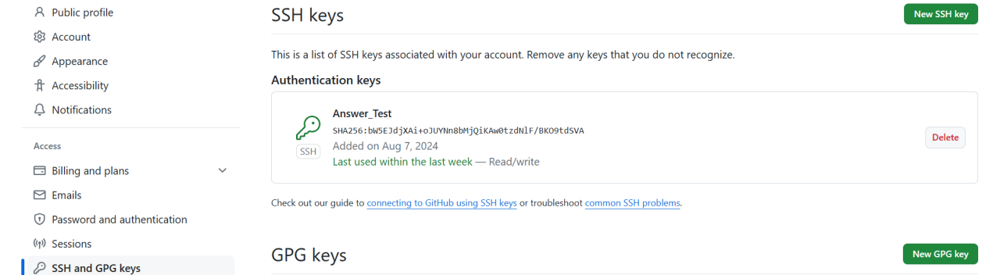
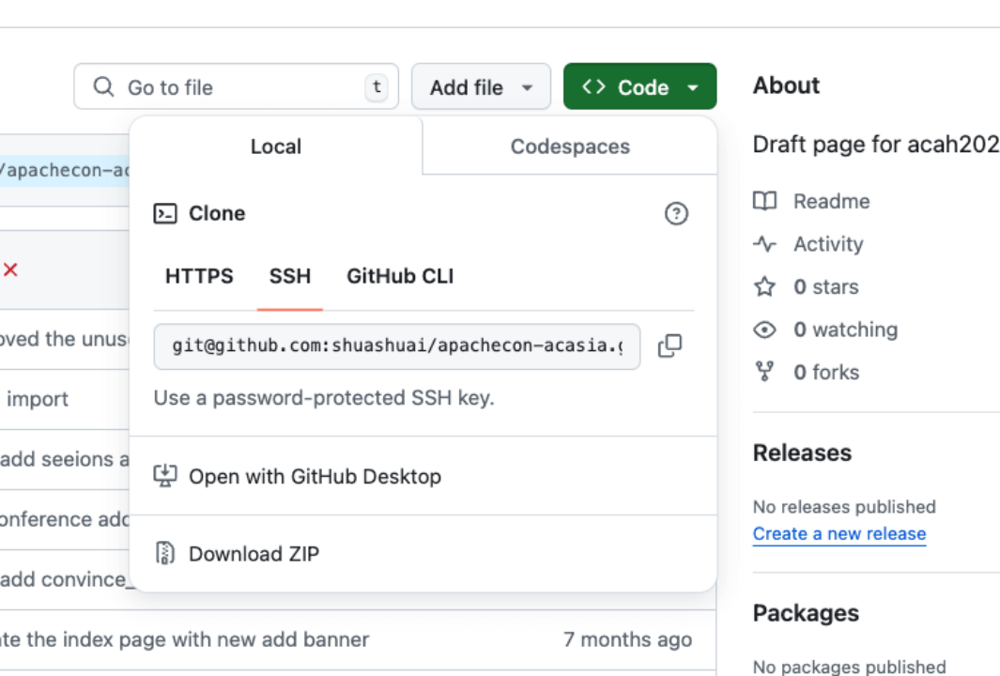
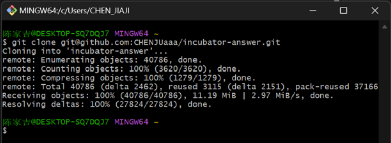
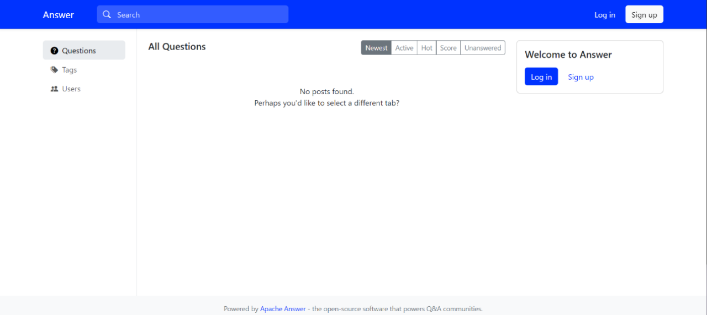

我们的官网为开发者提供了[开发者指南](https://answer.apache.org/zh-CN/docs/development/)帮助开发者能够快速完成前后端的配置，在今天这篇博客里，我们对如何进行前端和后端配置进行详细的拆解。

在 Answer 社区，我们欢迎并尊重多种不同的[贡献方式](https://answer.apache.org/zh-CN/community/contributing/)，无论是开发者还是非开发者可以跟随文章里面的步骤，完成 Answer 前端配置


### 1. 下载 Node.js 和 pnpm

点击[此处](https://nodejs.org/en)下载 Node.js，安装时选择 `Node.js runtime`。建议安装至默认位置。


在 Node 安装好之后，找到 `Node.js command prompt`。


打开 Node.js command prompt，输入`npm install -g pnpm`。当出现下面图的情况时，表示 pnpm 已经下载完成。

_注：pnpm有许多其他下载方式，适用于不同操作系统，详细请见其官网_


### 2. Clone the Repository

这个步骤目的是从 GitHub 中获取 Apache Answer 整个项目，点击[此处](https://github.com/apache/incubator-answer)访问 Apache Answer 的 GitHub Repo。


#### 2.1 Fork Answer 项目

登录 GitHub 账号，点击 Fork 整个 Answer 的项目。


#### 2.2 安装 Git/Git Bash

点击[此处](https://git-scm.com/downloads)，按照系统幸好，选择下载 Git。


#### 2.3 创建并配置 SSH

你可以浏览 GitHub 关于[通过 SSH 连接到 GitHub](https://docs.github.com/zh/authentication/connecting-to-github-with-ssh) 的文档，可跳过文档中为硬件安全密钥生成新的 SSH 密钥。

下图展示了配置完成后的 SSH 密钥。



#### 2.4 获取 Answer 项目

在 Answer GitHub 界面中找到 Code，点击展开后，复制 Answer 的 SSH 地址。


接着，打开 Git Bash ，输入以下指令克隆项目。
```
git clone <Answer的SSH地址>
```
如下图所示，完成之后就把项目成功拉取到本地文件夹。



### 3. 安装所有依赖项并构建所有本地包

我们将 Answer 项目的文件夹称为根目录，打开`命令行终端`运行以下命令，并从该目录进入 `ui` 子目录。
```
cd ./ui
pnpm install
```

**注意：Windows 系统，在运行 pnmp install 会遇到以下报错：**

这是由于系统权限导致的问题，可以先输入以下命令：
```
Set-ExecutionPolicy -ExecutionPolicy RemoteSigned -Scope CurrentUser
```
这条命令用于设置当前用户的 PowerShell 执行策略为 RemoteSigned，这意味着本地脚本可以运行，而远程脚本必须经过签名。

接着便可以顺利运行，运行完成后，视为安装完成。


### 4. 运行前端

配置完成后，在 ui 文件夹路径输入：`pnpm start` 即可运行 Answer。


你已经完成 Answer 的前端配置，如果你仍有其他问题，欢迎你在我们的[社区](https://meta.answer.dev/)和我们的小伙伴交流。