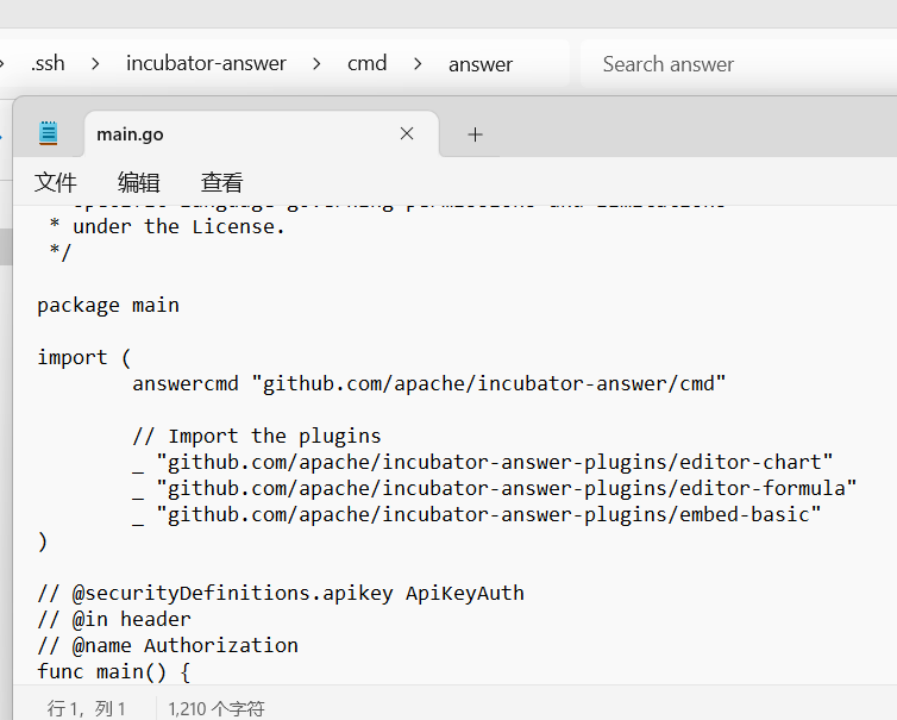

插件就像是一盒积木，你可以自由组合，把插件组合成你想要的功能。添加插件是扩展 Answer 功能的绝佳途径，本文将详细介绍插件的安装步骤，让你轻松添加插件，轻松掌握插件的安装和使用方法。

## 下载插件

1. 点击[此处](https://github.com/apache/incubator-answer-plugins/tree/main)从官方 Apache Answer 插件仓库下载所需插件。
2. 放置插件：将下载的插件文件，放置到项目目录下的 `./ui/src/plugins` 中
3. 插件类型参考： https://answer.apache.org/docs/development/plugins

_注意：文件夹应该是 plugins，而不是 plugin。_


## 安装标准 UI 插件（Standard UI Plugin）

1. 在终端执行 `cd ./ui` 到进入到ui目录 。
2. 安装依赖项：执行 `pnpm pre-install`。
3. 启动项目：执行 `pnpm start` 启动开发服务器。
4. 后端插件准备：在一个新的终端窗口，继续执行后端插件安装步骤。

## 安装后端插件（Backend Plugin）

1. 编译前端代码。
  - Linux/MacOS：执行 `make ui`。
  - Windows：执行 `pnpm install` 和 `pnpm build`。

2. 导入插件：在 `cmd/answer/main.go` 文件中，导入插件（将my-plugin替换成插件名）
```
import (
    answercmd "github.com/apache/incubator-answer/cmd"
    // Import the plugins
    _ "github.com/apache/incubator-answer-plugins/my-plugin"
)
```

下图以 editor-chart, editor-formula, embed-basic 插件为例。


3. 更新 go.mod：通过执行 `cd ..` 命令退回到 answer 根目录。使用 go mod edit 将插件添加到 go.mod 文件。
```
go mod edit -replace=github.com/apache/incubator-answer-plugins/my-plugin=./ui/src/plugins/my-plugin
```
注意：Windows 用户需要使用双引号，可参考下面的代码：
```
go mod edit -replace="github.com/apache/incubator-answer-plugins/my-plugin"="./ui/src/plugins/my-plugin"
```

以 editor-chart, editor-formula, embed-basic 插件为例。


4. 下载依赖：执行 `go mod tidy` 下载并更新依赖。
5. 启动项目：`go run cmd/answer/main.go run -C ./answer-data`。


在浏览器打开后端借口网址，可在 Admin - Installed Plugins 里看到添加的插件，点击 Action 列的 `⋮` 即可激活和移除该插件。

你已经完成了插件添加，点击[此处](https://answer.apache.org/plugins/)可以了解更多社区构建的插件。此外，我们还提供了 [Apache Answer 使用插件的详细教程](https://answer.apache.org/zh-CN/blog/2024/07/02/how-to-package-and-deploy-answer-plugins/)，以及[插件开发指南](https://answer.apache.org/zh-CN/docs/development/plugins/)，让你的 Apache Answer 变得更加强大。
