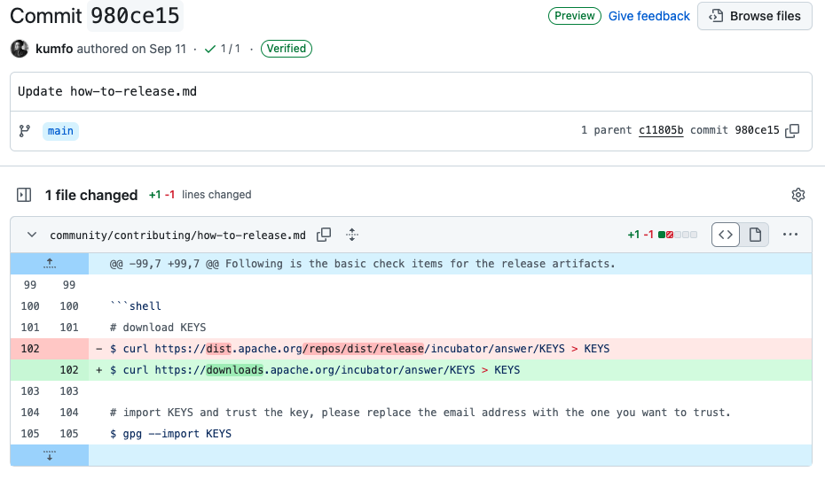

Apache 版本的发布是一套严谨的流程，需要严格验证、社区投票数字签名验证，并最终部署到 Apache 的官方发布平台。各个社区会指定一位 Release Manager 负责，比如：准备发布版本、执行发布、维护发布文档等。Apache 提倡由不同的 Committer 轮流担任此角色并参与到发版中来，这样可以保证发布质量、提升发布效率、优化发布流程。

自 2023 年 10 月进入 Apache 孵化器以来，Apache Answer 已经发布 8 个 Apache 版本，共有4 位 Release Manager 参与其中。在他们的帮助下， Apache Answer 在发布上积累了丰富的经验。合并代码打包的方式变得更加流畅，Release Doc 也更为细致，新增的邮件模板使得编写投票邮件更加容易。

在今天这篇博客里，我们将一同回顾 Release Manager 们在发版过程里遇到的问题，如何解决，以及 Release Doc 和发版流程的迭代优化。

## Release Doc 的迭代

文档的重要性不言而喻，作为发版的基石，Release Doc 对于发版指引有非常重要的作用，此外，这也展示了项目发版流程的规范性，以及项目是否具备了独立完成发版的能力。

LinkinStars 是 Apache Answer 的后端工程师，作为项目的[首位 Release Manager](https://answer.apache.org/blog/meet-our-release-manager-linkinstars)，他完成了第一版 Release Doc。该文档包含了完整的发版流程和步骤，包括证书的创建、打包、签名、验证、上传等，此外 LinkinStars 还整理了邮件使用的模板。不久后，Apache Answer 第一个 [Apache 版本](https://answer.apache.org/zh-CN/blog/a-new-chapter-begins-answer-first-apache-release-launches)于 2023 年 11 月 29 日发布。

在导师的建议下，Apache Answer 的 PPMC 成员开始轮流担任 Release Manager，参与到发版当中。这不仅帮助每个人都熟悉整个发版的流程，并在参与的过程中，能够发现可优化的部分，以文档的形式沉淀下来，帮助和确保发版工作能顺利进行。

Apache Answer 的第二位 Release Manager 是前端开发 shuai。他从 0-1 完成了 Apache Answer 的前端搭建，发版更新，以及编辑构建相关的优化等。此外，他经常还活跃在社区里，为其他社区成员答疑解惑。shuai 在发布过程中，对 Release Doc 进行初步补充，包括 GPG 密钥参数的解释、发布文件校验方法以及邮件主题链接的获取方式。

kumfo 接棒了 shuai 成为 Apache Answer 的第三位 Release Manager，作为一名后端开发，他参与到了声望、点赞等事件相关的功能开发， 他根据 IPMC Member 的意见进行了修改和补充。

当前，Apache Answer 的发版接力棒传递到了 robin 手上，他对文档进行了更为细致的修改，比如：将部分发版步骤进行拆分，补充细节，以及对整体文档进行了先后顺序的梳理和调整。

浏览由 4 位发版经理共同优化的最新 Apache Answer [发版文档](https://answer.apache.org/community/how-to-release) 。

## 挑战 & 解决方案

对于 LinkinStars 来说，第一次发布无疑是一次巨大的挑战。他先是与其他 PPMC Member 收集和整理相关的发布文档，整理成初步的发布流程。

你可以点击[此处](https://answer.apache.org/blog/behind-the-scene-how-we-launched-the-first-apache-release)，了解 Apache Answer 第一次 Apache 版本发布的幕后故事。

shuai 在接手后，参考了当时的 LinkinStar 的发版文档并提前准备了 GPG key，SVN 配置。
但在他仍遇到了邮件标题/内容写错，打包后内容丢失，签名不正确的问题。为了避免拷贝粘贴导致邮件格式出错，shuai 建议在本地先创建一个 .txt 文件，在发送邮件前可以先本地对邮件模版进行编辑修改，再复制到你的邮件编辑器。shuai 还在 GitHub 上创建了 [Apache 发版邮件模版库](https://github.com/shuashuai/apache-release-email)帮助后续的 Release Manager 避免再遇到此类的问题。

在遇到 General 投票等待时间较久时，除了发送 [REMINDER] 邮件进行提醒，可优先寻找项目导师进行投票。

在 Apache 社区里，所有的沟通都是透明且可追踪，这对于 Release Manager 参考过往 Apache 项目发布的流程和过往邮件有极大的帮助。Apache 的社区的氛围是开放和友好的，当出现问题时，会有人在邮件中指出并帮助你解决问题。比如在 General 投票阶段，导师指出了当时上传 SVN 仓库的发布文件内容错误，签名后的发布文件大小均为 0。后续经排查，发现时当时的 Release Manager 没有在下载这些发布文件的时候，浏览器对内容进行了限制，导致下载的文件不正确。

Release Manager 之间的协作和配合也是极为重要。在和 Release Manager 沟通时，他们多次提及在遇到问题时，会先咨询其他 Release Manager。在每次发版的过程里，除了细致和重复的检查，也可以邀请其他 Release Manager 来帮助验证，确保每一个步骤都没有问题。

在 Apache 的成功毕业指南里的毕业检查清单中，其中一项是展示可以发布 Apache 版本能力。这不仅需要项目有清晰的发版文档和透明的沟通机制，更需要社区各成员的一同努力。从需求分析、开发、测试到最终发布，社区各成员的协同合作是保证发布成功的关键。Apache Answer 欢迎和鼓励更多人加入到社区当中，一起打造更好的问答平台软件。
